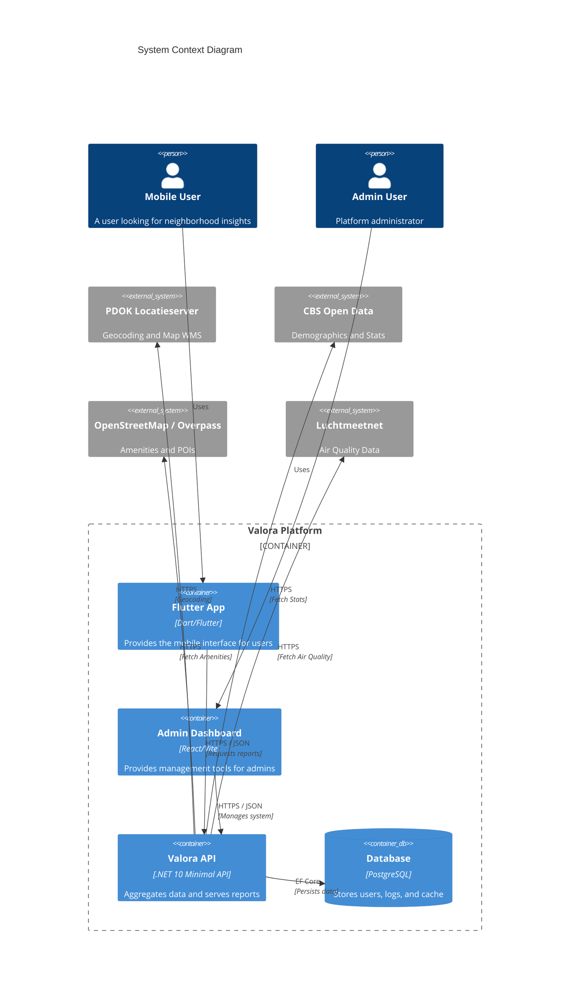
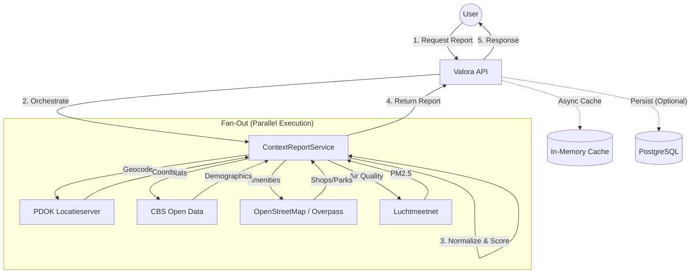
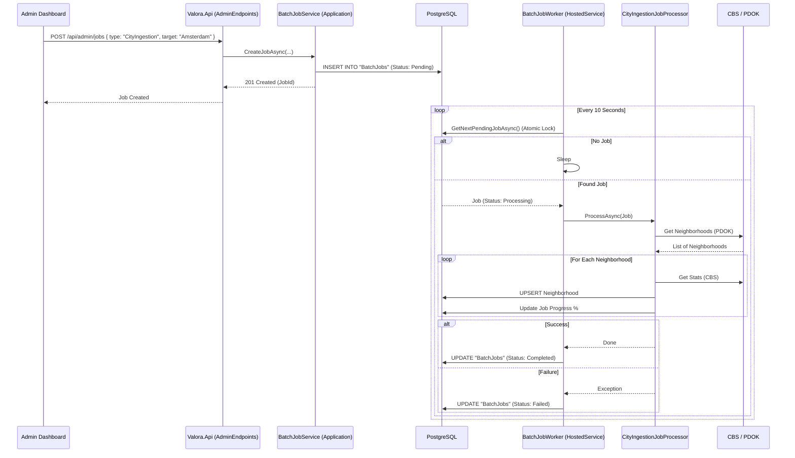

# Valora

**Valora is a public-context intelligence platform for residential locations in the Netherlands.**

It helps users understand the "vibe" and statistics of a neighborhood by aggregating data from public sources (CBS, PDOK, OpenStreetMap, Luchtmeetnet) into a unified, explainable context report.

> **Valora is NOT a scraper.** It does not copy listing photos or descriptions. It enriches location data with public context.

---

## Table of Contents
<!-- markdownlint-disable MD051 -->
- [Quick Start](#quick-start-10-minutes)
- [Architecture](#architecture)
- [Key Concepts](#key-concepts)
- [Project Structure](#project-structure)
- [Documentation Index](#documentation-index)
<!-- markdownlint-enable MD051 -->

---

## 🚀 Quick Start (10 Minutes)

Follow these steps to get the entire system running locally. For a detailed walkthrough, see the **[Onboarding Guide](docs/onboarding.md)**.

### Prerequisites & Dependencies
Before you start, ensure you have the following installed on your machine:
- **Docker Desktop** (for spinning up the local PostgreSQL database)
- **.NET 10.0 SDK** (for building and running the backend API)
- **Flutter SDK** (for running the mobile app on an emulator/device)
- **Node.js 18+ & npm** (for the web admin dashboard)

### 1. Setup & Start Local Infrastructure
First, you need to start the underlying database. Valora uses a PostgreSQL instance orchestrated via Docker Compose.

```bash
# Start the database in the background
docker-compose -f docker/docker-compose.yml up -d
```
*Troubleshooting:*
- If `docker-compose` fails, ensure Docker Desktop is running and actively connected.
- Ensure port `5432` is not already in use by a local Postgres instance (e.g., Homebrew's Postgres).

### 2. Configure & Run Backend
The backend aggregates data and serves the API.

**Note:** The `.env` file is primarily used by Docker. When running locally via `dotnet run`, configuration is read from `appsettings.Development.json` or Environment Variables.

```bash
cd backend
# Option A: Set secrets via User Secrets (Recommended)
dotnet user-secrets init --project Valora.Api
dotnet user-secrets set "JWT_SECRET" "YourStrongSecretKeyHere_MustBeAtLeast32CharsLong!" --project Valora.Api

# Option B: Set Environment Variable manually
export JWT_SECRET="YourStrongSecretKeyHere_MustBeAtLeast32CharsLong!"

# Run the API
dotnet run --project Valora.Api
```
*Verify: Open `http://localhost:5253/api/health` in your browser. You should see `{"status":"healthy", "timestamp": "..."}`.*

### 3. Configure & Run Mobile App
The Flutter app is the primary interface for users.

> ⚠️ **CRITICAL**: The default `.env` points to the PRODUCTION API.
> Change `API_URL` in `.env` to your local backend:
> - Android Emulator: `http://10.0.2.2:5253/api`
> - iOS Simulator / Desktop: `http://localhost:5253/api`
>
> *(Note: Use port `5001` if running backend via Docker)*

```bash
cd ../apps/flutter_app
cp .env.example .env
flutter pub get
flutter run
```

### 4. Configure & Run Admin Dashboard
The web dashboard for managing users and system settings.

```bash
cd ../apps/admin_page
cp .env.example .env
npm install
npm run dev
```

---

## 🏗️ Architecture Overview

Valora's architecture is specifically designed to act as an aggregation layer for public data, rather than a scraping pipeline. It is built on two primary structural pillars:

1.  **Strict Clean Architecture**: The backend strictly segregates concerns. External integrations (EF Core, HTTP clients) live in `Infrastructure`, HTTP routing lives in `Api`, and pure business logic lives in `Domain` and `Application`.
2.  **Fan-Out / Fan-In Fetching Pattern**: Instead of persisting millions of real estate listings, the system queries external providers in parallel only when a user requests a report.

### System Context & Data Flow

The following diagram shows how Valora fits into the broader ecosystem.



For a deeper dive into *why* we built it this way, see **[Architecture Decisions](docs/architecture-decisions.md)**.

### The "Fan-Out" Aggregation Pattern
When a user requests a context report, the system queries multiple external sources in parallel ("Fan-Out") and then aggregates the results ("Fan-In") into a unified score.



### Key Components

| Layer | Responsibility | Key Tech |
|---|---|---|
| **Valora.Domain** | Core business rules and entities. Zero dependencies. | C# |
| **Valora.Application** | Use cases (e.g., `GetContextReport`). Orchestrates data flow. | MediatR |
| **Valora.Infrastructure** | External integrations (Database, APIs). | EF Core, HttpClient |
| **Valora.Api** | Entry point. Configuration, Auth, and HTTP handling. | ASP.NET Core Minimal APIs |
| **Flutter App** | Cross-platform mobile client. | Flutter, Provider |

---

## 💡 Key Concepts

### 1. The "Fan-Out" Context Report
When a user requests a report for an address, Valora does **not** look up a pre-existing record. It generates the report in real-time by querying multiple external sources in parallel.

- **Why?** Data freshness and coverage. We don't need to scrape or store millions of records.
- **How?** See `ContextReportService.cs`. It uses `Task.WhenAll` to fetch data from CBS, PDOK, and OSM simultaneously.

### 2. Batch Job Processing (City Ingestion)
Background tasks, such as fetching all neighborhoods for a city from CBS, are handled using a robust background worker architecture. This decouples long-running tasks from API requests.

- **Why?** To prevent API request timeouts and handle massive ingestion jobs reliably in the background without blocking the UI.
- **How?** See `BatchJobExecutor.cs`. The `BatchJobWorker` continuously polls for pending jobs. Once grabbed, a `CityIngestionJobProcessor` fetches the neighborhoods from PDOK and fetches stats from CBS for each.



## 📖 API Reference Summary

The API provides core functionalities to access and manage Valora's context data. Below is a brief summary of key endpoints. For complete details, see the **[API Reference](docs/api-reference.md)**.

- **Authentication:** `POST /api/auth/login`, `POST /api/auth/register` (JWT-based)
- **Context Reports:** `POST /api/context/report` (Generates reports via Fan-Out)
- **Map Visualizations:** `GET /api/map/cities`, `GET /api/map/overlays`
- **AI Features:** `POST /api/ai/chat`, `POST /api/ai/analyze-report`
- **Admin & Jobs:** `GET /api/admin/users`, `POST /api/admin/jobs`

---

## 📂 Project Structure

```
├── apps/
│   ├── flutter_app/      # The primary mobile application
│   └── admin_page/       # Web dashboard for user management
├── backend/
│   ├── Valora.Api/           # API Entry point
│   ├── Valora.Application/   # Business logic & Use cases
│   ├── Valora.Domain/        # Core entities (Enterprise logic)
│   └── Valora.Infrastructure/# External implementations (DB, APIs)
├── docker/               # Docker Compose files
└── docs/                 # Detailed documentation
```

## 📚 Documentation Index

### 📘 Onboarding & Guides
*Start here to understand how to run and use Valora.*

- **[Onboarding Guide](docs/onboarding.md)** (⭐ Recommended)
    - Detailed, step-by-step setup instructions for Docker, Backend, and Frontend.
    - Troubleshooting for common errors (Database, JWT, API URL).
- **[User Guide](docs/user-guide.md)**: How to use the mobile app to generate reports.
- **[Admin App Guide](apps/admin_page/README.md)**: Setup and features for the admin dashboard.

### 🧩 Architecture & Data Flow
*Understand the internal plumbing and design decisions.*

- **[Architecture Decisions](docs/architecture-decisions.md)**: The "Why" behind Clean Architecture and Fan-Out.
- **[Data Flow: Reading (Fan-Out)](docs/onboarding-data-flow.md)** (Includes Mermaid Diagram):
    - Explains the API request lifecycle from Flutter -> API -> PDOK/CBS/OSM -> Report.
- **[Data Flow: Writing (Persistence)](docs/onboarding-persistence-flow.md)** (Includes Mermaid Diagram):
    - Walkthrough of the data flow from API request down to database persistence (e.g., User Registration).
- **[Data Flow: API to DB Lifecycle](docs/onboarding-api-to-db-guide.md)** (Includes Mermaid Diagram):
    - Comprehensive guide tracing the exact path a write request takes in Valora, passing through Clean Architecture to PostgreSQL.
- **[Data Flow: Batch Jobs](docs/onboarding-batch-job-flow.md)**:
    - Explains background processing (City Ingestion).

### ⚙️ Developer Reference
*Technical details for contributors.*

- **[API Reference](docs/api-reference.md)**: Complete list of endpoints, request bodies, and authentication methods.
- **[Developer Guide](docs/developer-guide.md)**: Coding standards, patterns, and testing protocols.

---

*Missing documentation? Open an issue or check the `docs/` folder.*
