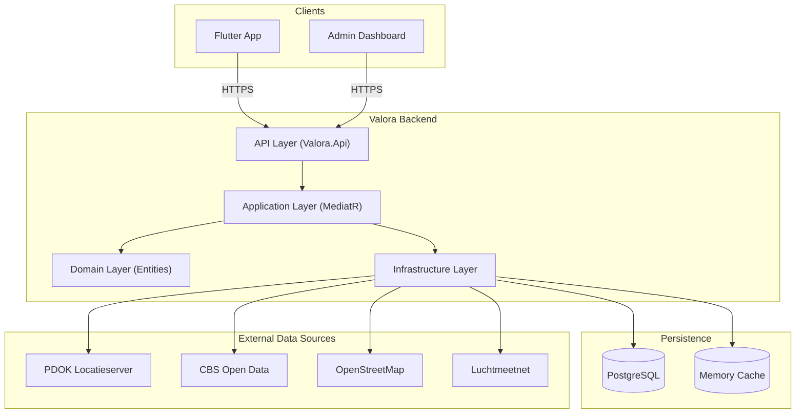
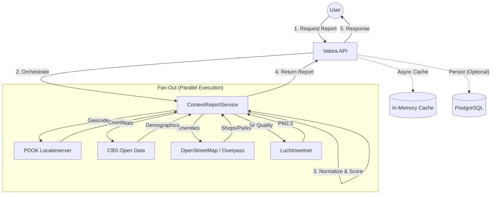

# Valora

**Valora is a public-context intelligence platform for residential locations in the Netherlands.**

It answers the question *"What is it like to live here?"* by aggregating data from public sources (CBS, PDOK, OpenStreetMap, Luchtmeetnet) into a unified, explainable context report.

> **Valora is NOT a scraper.** It does not copy listing photos or descriptions. It enriches location data with public context.

---

## ⚡ Quick Start (10 Minutes)

Follow this checklist to get the entire system running locally.

### Prerequisites
- [ ] **Docker Desktop** (running)
- [ ] **.NET 10.0 SDK**
- [ ] **Flutter SDK**
- [ ] **Node.js 18+**

### 1. Start Infrastructure
Run the database container.
```bash
docker-compose -f docker/docker-compose.yml up -d
```
*Check:* Run `docker ps`. You should see `valora-db` running on port 5432.

### 2. Configure & Run Backend
The backend aggregates data and serves the API.

```bash
cd backend
# Set the JWT Secret (Required for Auth)
dotnet user-secrets init --project Valora.Api
dotnet user-secrets set "JWT_SECRET" "YourStrongSecretKeyHere_MustBeAtLeast32CharsLong!" --project Valora.Api

# Run the API
dotnet run --project Valora.Api
```
*Check:* Open [http://localhost:5253/api/health](http://localhost:5253/api/health). You should see `{"status":"healthy",...}`.

### 3. Configure & Run Mobile App
The Flutter app is the primary interface for users.

```bash
cd ../apps/flutter_app
cp .env.example .env
```
> ⚠️ **CRITICAL**: Open `.env` and set `API_URL` to:
> - Android Emulator: `http://10.0.2.2:5001/api`
> - iOS Simulator / Desktop: `http://localhost:5001/api`

```bash
flutter pub get
flutter run
```

### 4. Configure & Run Admin Dashboard (Optional)
The web dashboard for managing users and system settings.

```bash
cd ../apps/admin_page
cp .env.example .env
npm install
npm run dev
```

---

## 🏗️ Architecture

Valora follows **Clean Architecture** principles to ensure modularity and testability.

### System Overview



### The "Fan-Out" Aggregation Pattern
When a user requests a context report, the system queries multiple external sources in parallel ("Fan-Out") and then aggregates the results ("Fan-In") into a unified score.



---

## 🔌 API Reference

The API is built with ASP.NET Core Minimal APIs. Full reference is available in **[docs/api-reference.md](docs/api-reference.md)**.

| Method | Endpoint | Description |
|---|---|---|
| `POST` | `/api/auth/register` | Create a new user account. |
| `POST` | `/api/auth/login` | Login and receive JWT tokens. |
| `POST` | `/api/context/report` | **Core:** Generate a report for an address (Fan-Out). |
| `GET` | `/api/map/cities` | Get aggregated city scores for map visualization. |
| `POST` | `/api/ai/chat` | Chat with the Valora AI assistant. |
| `GET` | `/api/admin/stats` | (Admin) Get system usage statistics. |

---

## 📂 Project Structure

```
├── apps/
│   ├── flutter_app/      # The primary mobile application
│   └── admin_page/       # Web dashboard for user management
├── backend/
│   ├── Valora.Api/           # API Entry point
│   ├── Valora.Application/   # Business logic & Use cases
│   ├── Valora.Domain/        # Core entities (Enterprise logic)
│   └── Valora.Infrastructure/# External implementations (DB, APIs)
├── docker/               # Docker Compose files
└── docs/                 # Detailed documentation
```

## 📚 Documentation Index

- **[Onboarding Guide](docs/onboarding.md)**: Detailed setup & troubleshooting.
- **[User Guide](docs/user-guide.md)**: How to use the app to generate reports.
- **[Developer Guide](docs/developer-guide.md)**: Coding standards & patterns.
- **[API Reference](docs/api-reference.md)**: Endpoints & contracts.
- **[Data Flow: Reading (Reports)](docs/onboarding-data-flow.md)**: Deep dive into the aggregation engine.
- **[Data Flow: Writing (Persistence)](docs/onboarding-persistence-flow.md)**: User registration and data saving.
- **[Admin App Guide](apps/admin_page/README.md)**: Setup and features for the admin dashboard.

---

*Missing documentation? Open an issue or check the `docs/` folder.*
