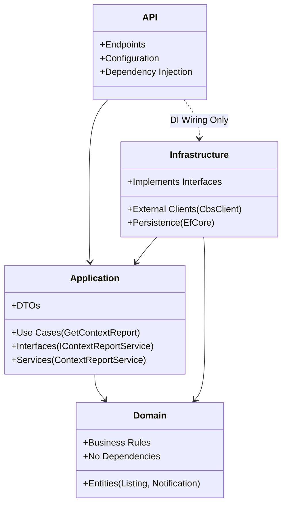

# Valora

Valora is a public-context intelligence platform for residential locations in the Netherlands.

It helps users understand the "vibe" and statistics of a neighborhood by aggregating data from public sources (CBS, PDOK, OpenStreetMap, Luchtmeetnet) into a unified, explainable context report.

## 🚀 Start Here

> **[Get Started in 10 Minutes](docs/onboarding.md)**: Follow the automated setup guide to run the app.

### Quick Setup

We provide a script to set up your environment automatically.

**Prerequisites:** Docker, .NET 10 SDK, Flutter SDK.

1.  **Run the setup script:**
    ```bash
    ./setup.sh
    ```
    This will verify prerequisites, configure environment variables (`.env`), and generate secure secrets.

2.  **Follow the printed instructions** to start the database, backend, and frontend.

---

## System Context

Valora acts as an intelligent aggregator between the user and Dutch open data ecosystems.

```mermaid
graph TD
    User((User)) -->|Input Address/URL| App[Flutter App]
    App -->|API Request| Backend[Valora Backend]

    subgraph "External Data Sources"
        Backend -->|Geocoding| PDOK[PDOK Locatieserver]
        Backend -->|Demographics/Crime| CBS[CBS StatLine]
        Backend -->|Amenities| OSM[OpenStreetMap (Overpass)]
        Backend -->|Air Quality| Air[Luchtmeetnet]
    end

    Backend -->|Persist| DB[(PostgreSQL)]
    Backend -->|Cache| Cache[(Memory/Redis)]
```

## Key Features

-   **Context Reports**: Generate on-demand reports for any Dutch address with scores for Safety, Social, Amenities, and Environment.
-   **Listing Enrichment**: Enhance real estate listings with persistent context data for advanced filtering.
-   **Explainable Scoring**: Transparent 0-100 scores derived from raw data (e.g., crime rates, distance to schools).
-   **Clean Architecture**: Modular, testable backend design separating Domain, Application, and Infrastructure.
-   **Resilience**: "Fan-out" data fetching ensures partial reports are generated even if one data source is down.

## Architecture

Valora follows **Clean Architecture** principles to separate concerns and maintain testability.



### Layer Responsibilities

-   **Valora.Domain**: Core entities and business rules. The heart of the system.
-   **Valora.Application**: Defines *what* the system does (Interfaces, Use Cases, Orchestration Services like `ContextReportService`). Depends only on Domain.
-   **Valora.Infrastructure**: Defines *how* it works (External APIs, Database, Implementations). Implements Application interfaces.
-   **Valora.Api**: The entry point. Wires everything together and handles HTTP requests.

## Documentation Index

-   **[Onboarding Guide](docs/onboarding.md)**: detailed setup instructions.
-   **[API Reference](docs/api-reference.md)**: Full endpoint documentation.
-   **[Data Flow: Report Generation](docs/onboarding-data-flow.md)**: Deep dive into the "Fan-Out" process.
-   **[Data Flow: Enrichment](docs/data-flow-enrichment.md)**: How listings are stored and updated.
-   **[Developer Guide](docs/developer-guide.md)**: Coding standards, patterns, and testing.
-   **[User Guide](docs/user-guide.md)**: App features walkthrough.

## API Reference

| Method | Endpoint | Description |
|---|---|---|
| `POST` | `/api/context/report` | **Core:** Generate report from address/URL. |
| `POST` | `/api/listings/{id}/enrich` | Update listing with context data. |
| `POST` | `/api/auth/login` | Authenticate user. |
| `GET` | `/api/listings` | Search and filter listings. |

See **[API Reference](docs/api-reference.md)** for full details.
