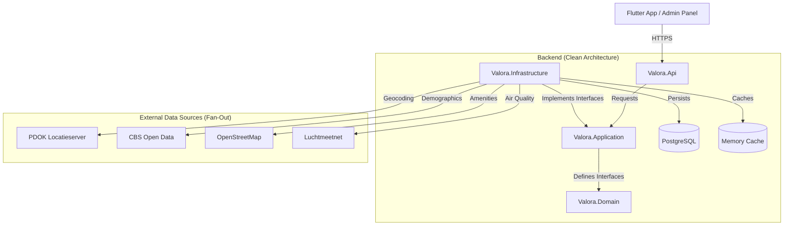
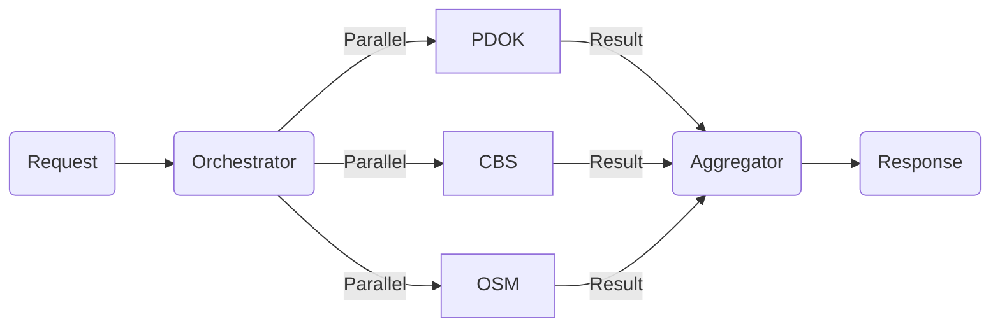

# Valora

**Valora is a public-context intelligence platform for residential locations in the Netherlands.**

It helps users understand the "vibe" and statistics of a neighborhood by aggregating data from public sources (CBS, PDOK, OpenStreetMap, Luchtmeetnet) into a unified, explainable context report.

> **Valora is NOT a scraper.** It does not copy listing photos or descriptions. It enriches location data with public context.

---

## 🚀 Quick Start (10 Minutes)

Follow these steps to get the entire system running locally.

### Prerequisites
- **Docker Desktop** (for database)
- **.NET 10.0 SDK** (for backend)
- **Flutter SDK** (for mobile app)
- **Node.js 18+** (for admin dashboard)

### 1. Start Infrastructure
Run the database container.
```bash
docker-compose -f docker/docker-compose.yml up -d
```
*Troubleshooting:* If `docker-compose` fails, ensure Docker Desktop is running. Check port 5432 availability.

### 2. Configure & Run Backend
The backend aggregates data and serves the API.

```bash
cd backend
cp .env.example .env
# default .env values work out-of-the-box for local dev
dotnet run --project Valora.Api
```
*Verify: Open `http://localhost:5253/api/health` in your browser (or port `5001` if running via Docker). You should see `{"status":"healthy", "timestamp": "..."}`.*

### 3. Configure & Run Mobile App
The Flutter app is the primary interface for users.

> ⚠️ **CRITICAL**: The default `.env` points to the PRODUCTION API.
> Change `API_URL` in `.env` to your local backend:
> - Android Emulator: `http://10.0.2.2:5001/api`
> - iOS Simulator / Desktop: `http://localhost:5001/api`

```bash
cd ../apps/flutter_app
cp .env.example .env
flutter pub get
flutter run
```

### 4. Configure & Run Admin Dashboard
The web dashboard for managing users and system settings.

```bash
cd ../apps/admin_page
cp .env.example .env
npm install
npm run dev
```

---

## 🏗️ Architecture

Valora follows **Clean Architecture** principles to ensure modularity and testability.

### High-Level System Design



### The "Fan-Out" Aggregation Pattern
When a user requests a context report, the system queries multiple external sources in parallel ("Fan-Out") and then aggregates the results ("Fan-In") into a unified score.



### Key Components

| Layer | Responsibility | Key Tech |
|---|---|---|
| **Valora.Domain** | Core business rules and entities. Zero dependencies. | C# |
| **Valora.Application** | Use cases (e.g., `GetContextReport`). Orchestrates data flow. | MediatR |
| **Valora.Infrastructure** | External integrations (Database, APIs). | EF Core, HttpClient |
| **Valora.Api** | Entry point. Configuration, Auth, and HTTP handling. | ASP.NET Core Minimal APIs |
| **Flutter App** | Cross-platform mobile client. | Flutter, Provider |

---

## 💡 Key Concepts

### 1. The "Fan-Out" Context Report
When a user requests a report for an address, Valora does **not** look up a pre-existing record. It generates the report in real-time by querying multiple external sources in parallel.

- **Why?** Data freshness and coverage. We don't need to scrape or store millions of records.
- **How?** See `ContextReportService.cs`. It uses `Task.WhenAll` to fetch data from CBS, PDOK, and OSM simultaneously.

---

## 📂 Project Structure

```
├── apps/
│   ├── flutter_app/      # The primary mobile application
│   └── admin_page/       # Web dashboard for user management
├── backend/
│   ├── Valora.Api/           # API Entry point
│   ├── Valora.Application/   # Business logic & Use cases
│   ├── Valora.Domain/        # Core entities (Enterprise logic)
│   └── Valora.Infrastructure/# External implementations (DB, APIs)
├── docker/               # Docker Compose files
└── docs/                 # Detailed documentation
```

## 📚 Documentation Index

- **[Onboarding Guide](docs/onboarding.md)**: Detailed setup & troubleshooting.
- **[Data Flow: Reports](docs/onboarding-data-flow.md)**: Deep dive into the aggregation engine.
- **[Data Flow: Persistence](docs/onboarding-persistence-flow.md)**: How data is saved to the database (User Registration).
- **[Developer Guide](docs/developer-guide.md)**: Coding standards & patterns.
- **[API Reference](docs/api-reference.md)**: Endpoints & contracts.
- **[Admin App Guide](apps/admin_page/README.md)**: Setup and features for the admin dashboard.

---

*Missing documentation? Open an issue or check the `docs/` folder.*
