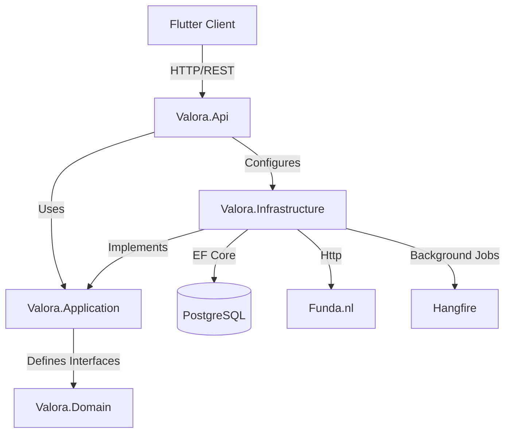

# Valora

House listing scraper for funda.nl.

## Stack

- **Backend**: .NET 10 (Minimal APIs, EF Core, Clean Architecture)
- **Frontend**: Flutter (Web, iOS, Android, Desktop)
- **Database**: PostgreSQL
- **Orchestration**: Docker Compose
- **Background Jobs**: Hangfire

## Architecture Overview

Valora follows **Clean Architecture** principles to ensure separation of concerns and testability.

- **Valora.Domain**: The core of the application containing entities (`Listing`, `PriceHistory`, `ApplicationUser`) and business rules. It has no dependencies.
- **Valora.Application**: Defines use cases, interfaces (`IListingRepository`, `IScraperService`), and DTOs. It depends only on Domain.
- **Valora.Infrastructure**: Implements the interfaces defined in Application. Handles database access (EF Core), external API calls (Funda), and background jobs.
- **Valora.Api**: The entry point. Configures Dependency Injection, maps HTTP endpoints, and handles middleware.



## Structure

```
valora/
├── apps/flutter_app/     # Flutter app
├── backend/              # .NET 10 API
│   ├── Valora.Api/            # Entry point & Endpoints
│   ├── Valora.Application/    # Business Logic & Interfaces
│   ├── Valora.Domain/         # Entities
│   ├── Valora.Infrastructure/ # Implementation (EF, Scraper)
│   └── Valora.UnitTests/      # Unit Tests
└── docker/               # Docker Compose
```

## Documentation

- [User Guide](docs/user-guide.md): How to use Valora.
- [Developer Guide](docs/developer-guide.md): Architecture, API, Data Flow, and implementation details.

## Getting Started

### Prerequisites

- .NET 10 SDK
- Flutter SDK
- Docker Desktop

### 1. Database Setup

Start the PostgreSQL database using Docker Compose:

```bash
docker-compose -f docker/docker-compose.yml up -d
```

### 2. Backend Setup

The backend relies on environment variables. Copy the example file and configure it:

```bash
cd backend
cp .env.example .env
```

> **Note**: **Database migrations are applied automatically** when the backend starts. You do not need to run manual migration commands.

Ensure `JWT_SECRET` is set in your environment or `.env` file. For local development, the app will warn but fallback to a dev key if missing.

Run the backend:

```bash
dotnet restore
dotnet build
dotnet run --project Valora.Api
```

The server will start at `http://localhost:5000`.

### 3. Frontend Setup

```bash
cd apps/flutter_app
cp .env.example .env
flutter pub get
flutter run
```

## API Reference

The backend provides the following key endpoints:

| Method | Endpoint | Description | Auth Required |
|--------|----------|-------------|---------------|
| `GET` | `/api/health` | Health check | No |
| `POST` | `/api/auth/login` | Login and get JWT | No |
| `POST` | `/api/auth/register` | Create a new user | No |
| `GET` | `/api/listings` | Get paginated listings | Yes |
| `GET` | `/api/listings/{id}` | Get listing details | Yes |
| `POST` | `/api/scraper/trigger` | Trigger manual scrape | Yes |
| `POST` | `/api/scraper/trigger-limited` | Trigger scrape for specific region | Yes |

See [Developer Guide](docs/developer-guide.md) for full API documentation and Data Flow explanation.

## Troubleshooting

### "Backend not connected"
- Ensure the backend is running on port 5000.
- Check if `http://localhost:5000/api/health` returns `200 OK`.
- Verify the frontend `.env` points to the correct `API_URL`.

### "JWT Secret is missing"
- The backend will throw an error if `JWT_SECRET` is not set in production.
- For development, it falls back to a temporary key, but you should set it in `backend/.env`.

### "Database connection failed"
- Ensure the Docker container is running: `docker ps`.
- Check connection string in `.env` or `appsettings.json` (if used, though env vars are preferred).
