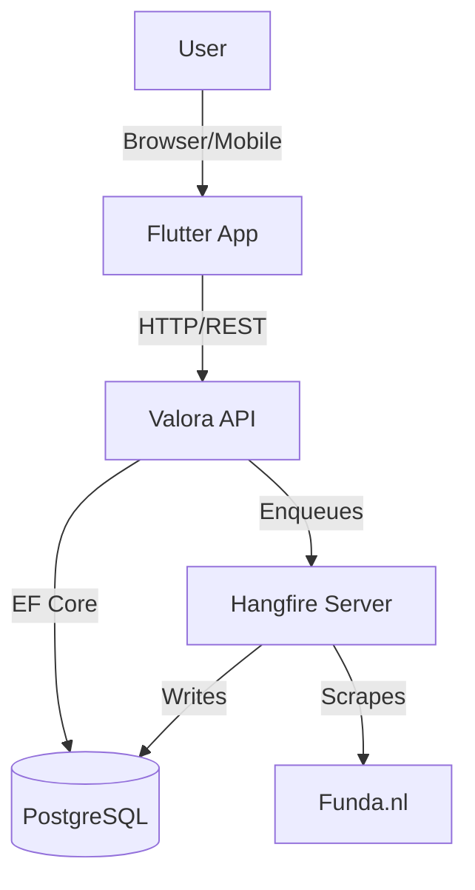
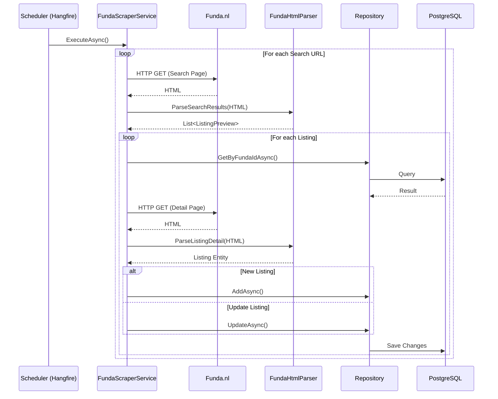

# Valora

House listing scraper for funda.nl.

## Architecture



### Scraping Flow



## Prerequisites

Before you begin, ensure you have met the following requirements:

- **Docker Desktop**: Required for the database and Hangfire storage.
- **.NET 10 SDK**: Required to build and run the backend.
- **Flutter SDK 3.x**: Required to build and run the frontend.

## Stack

- **Backend**: .NET 10 (Minimal APIs, EF Core, Clean Architecture)
- **Frontend**: Flutter (Web, iOS, Android, Desktop)
- **Database**: PostgreSQL
- **Background Jobs**: Hangfire

## Documentation

- [User Guide](docs/user-guide.md): How to use Valora.
- [Developer Guide](docs/developer-guide.md): Architecture, API, and implementation details.
- [Onboarding Guide](docs/onboarding.md): Understanding the data flow and life of a request.

## Getting Started

### 1. Database Setup

Start the PostgreSQL database using Docker:

```bash
docker-compose -f docker/docker-compose.yml up -d
```

### 2. Backend Setup

Navigate to the backend directory and run the API:

```bash
cd backend
dotnet restore
dotnet build
# Apply migrations (optional if automatic migration is enabled)
# dotnet ef database update --project Valora.Infrastructure --startup-project Valora.Api
dotnet run --project Valora.Api
```

The backend will start on `http://localhost:5000`.

**Note:** Ensure your database connection string in `appsettings.json` matches your Docker configuration.

### 3. Frontend Setup

Navigate to the frontend directory. Create a `.env` file by copying the example:

```bash
cd apps/flutter_app
cp .env.example .env
flutter pub get
flutter run
```

## API Reference

The backend provides a RESTful API. Key endpoints include:

| Method | Endpoint | Description |
|--------|----------|-------------|
| `GET` | `/api/listings` | Get a paginated list of real estate listings. |
| `GET` | `/api/listings/{id}` | Get details of a specific listing. |
| `POST` | `/api/scraper/trigger` | Manually trigger the scraper job. |
| `GET` | `/hangfire` | Access the Hangfire Dashboard to monitor jobs. |

For detailed API documentation, refer to the [Developer Guide](docs/developer-guide.md).
