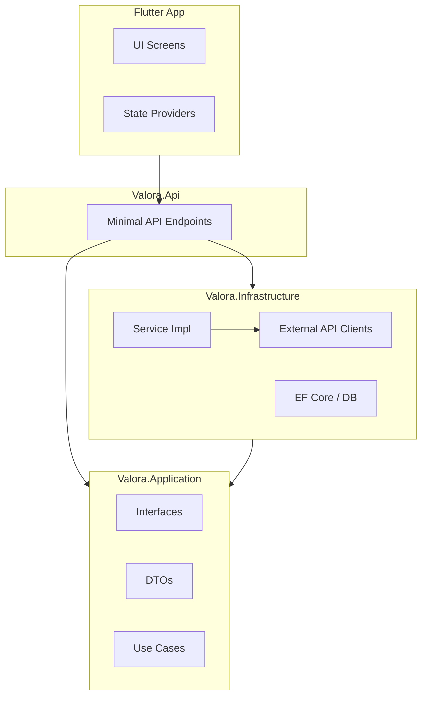

# Valora

Valora is a public-context intelligence platform for residential locations in the Netherlands.

The app accepts a listing link or plain address as input, resolves it to a location, and generates a context report using public/open APIs (CBS, PDOK, OSM/Overpass, Luchtmeetnet, and others as configured).

## Product Direction

- Input: listing URL or address text
- Resolution: normalized address + coordinates + admin codes
- Enrichment: public API connectors queried on demand
- Output: explainable context report (social, amenities, environment, accessibility-ready)

## What Changed

Valora no longer runs a Funda scraper pipeline. Scraping jobs and scraper endpoints were removed.

## Configuration and API Keys

### Backend (`backend/.env`)

Required for local run:

- `DATABASE_URL`
- `JWT_SECRET`
- `JWT_ISSUER`
- `JWT_AUDIENCE`

Optional (feature-dependent):

- `OPENROUTER_API_KEY`: only required when using `/api/ai/chat`
- `OPENROUTER_MODEL`
- `OPENROUTER_BASE_URL`
- `OPENROUTER_SITE_URL`
- `OPENROUTER_SITE_NAME`

Optional source overrides (default public endpoints are already set in `.env.example`):

- `CONTEXT_PDOK_BASE_URL`
- `CONTEXT_CBS_BASE_URL`
- `CONTEXT_OVERPASS_BASE_URL`
- `CONTEXT_LUCHTMEETNET_BASE_URL`

Optional cache tuning:

- `CONTEXT_RESOLVER_CACHE_MINUTES`
- `CONTEXT_CBS_CACHE_MINUTES`
- `CONTEXT_AMENITIES_CACHE_MINUTES`
- `CONTEXT_AIR_CACHE_MINUTES`
- `CONTEXT_REPORT_CACHE_MINUTES`

### Frontend (`apps/flutter_app/.env`)

- `API_URL` (required)
- `SENTRY_DSN` (optional)

## Quick Start

### Prerequisites
- Docker Desktop
- .NET 10 SDK
- Flutter SDK

### Setup Steps

1.  **Infrastructure:** Start the database and redis (if configured).
    ```bash
    docker-compose -f docker/docker-compose.yml up -d
    ```

2.  **Backend:** Configure and run the API.
    ```bash
    cd backend
    cp .env.example .env
    # Ensure DATABASE_URL and JWT secrets are set in .env
    dotnet run --project Valora.Api
    ```
    *Verify:* `curl http://localhost:5001/api/health`

3.  **Frontend:** Configure and run the mobile app.
    ```bash
    cd apps/flutter_app
    cp .env.example .env
    flutter pub get
    flutter run
    ```

## Architecture

Valora follows Clean Architecture principles to separate concerns and maintain testability.



- **Valora.Domain:** Core entities and business rules (e.g., `Listing`, `Report`). No external dependencies.
- **Valora.Application:** Use case definitions, interfaces, and DTOs. Defines *what* the system does.
- **Valora.Infrastructure:** Implementations of interfaces (e.g., EF Core repositories, HTTP clients for CBS/PDOK). Defines *how* it works.
- **Valora.Api:** Entry point, dependency injection wiring, and HTTP routing.

For a deep dive into the data flow, see [Data Flow: From Request to Report](docs/onboarding-data-flow.md).

## API Reference

| Method | Endpoint | Auth | Description |
|---|---|---|---|
| `GET` | `/api/health` | No | Service + DB connectivity check |
| `POST` | `/api/auth/register` | No | Register user |
| `POST` | `/api/auth/login` | No | Login and receive JWT |
| `POST` | `/api/auth/refresh` | No | Refresh expired access token |
| `POST` | `/api/context/report` | **Yes** | Generates a context report from an address or Funda URL. |
| `POST` | `/api/listings/{id}/enrich` | **Yes** | Updates an existing listing entity with fresh context data. |

> **Note:** The `/api/context/report` endpoint is the core of the application. It aggregates data from 5+ external sources in parallel.

## Documentation

- [Onboarding Guide](docs/onboarding.md)
- [Data Flow Deep Dive](docs/onboarding-data-flow.md)
- [Developer Guide](docs/developer-guide.md)
- [User Guide](docs/user-guide.md)
