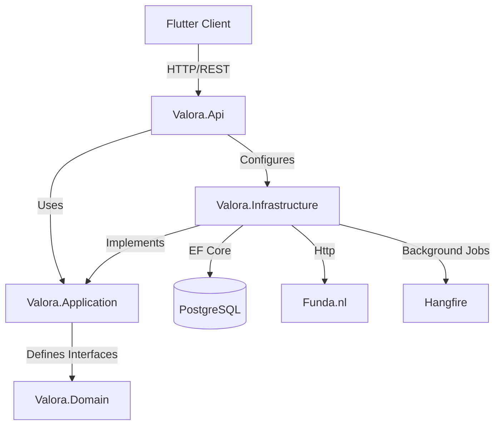

# Valora

House listing scraper and tracker for funda.nl.

## Stack

- **Backend**: .NET 10 (Minimal APIs, EF Core, Clean Architecture)
- **Frontend**: Flutter (Web, iOS, Android, Desktop)
- **Database**: PostgreSQL
- **Orchestration**: Docker Compose
- **Background Jobs**: Hangfire

## Documentation

- **[Onboarding Guide](docs/onboarding.md)**: Start here! Data flow walkthroughs and first steps.
- [User Guide](docs/user-guide.md): How to use the application.
- [Developer Guide](docs/developer-guide.md): Deep dive into architecture and implementation.

## Architecture Overview

Valora follows **Clean Architecture** principles to ensure maintainability and testability.



- **Valora.Domain**: The core. Contains entities (`Listing`) and business rules. No dependencies.
- **Valora.Application**: The logic. Defines interfaces (`IListingRepository`), use cases, and DTOs. Depends only on Domain.
- **Valora.Infrastructure**: The machinery. Implements interfaces (EF Core, Funda Scraper). Depends on Application and Domain.
- **Valora.Api**: The entry point. Configures DI and maps HTTP endpoints. Depends on Application and Infrastructure.

## Structure

```
valora/
├── apps/flutter_app/     # Flutter app
├── backend/              # .NET 10 API
│   ├── Valora.Api/            # Entry point & Endpoints
│   ├── Valora.Application/    # Business Logic & Interfaces
│   ├── Valora.Domain/         # Entities
│   ├── Valora.Infrastructure/ # Implementation (EF, Scraper)
│   └── Valora.UnitTests/      # Unit Tests
└── docker/               # Docker Compose
```

## Quick Start

Get up and running in minutes.

### Prerequisites

- Docker Desktop
- .NET 10 SDK (for backend dev)
- Flutter SDK (for frontend dev)

### 1. Start Infrastructure

Start PostgreSQL and other services:

```bash
docker-compose -f docker/docker-compose.yml up -d
```

### 2. Run Backend

```bash
cd backend
cp .env.example .env
dotnet run --project Valora.Api
```
*Server starts at `http://localhost:5000`*

### 3. Run Frontend

```bash
cd apps/flutter_app
cp .env.example .env
flutter pub get
flutter run
```

## API Reference

The backend provides the following key endpoints (see `Valora.Api/Program.cs` for full list):

| Method | Endpoint | Description | Auth Required |
|--------|----------|-------------|---------------|
| `GET` | `/api/health` | Health check | No |
| `POST` | `/api/auth/login` | Login and get JWT | No |
| `POST` | `/api/auth/register` | Create a new user | No |
| `GET` | `/api/listings` | Get paginated listings | Yes |
| `GET` | `/api/listings/{id}` | Get listing details | Yes |
| `POST` | `/api/scraper/trigger` | Trigger manual scrape | Yes |

## Troubleshooting

- **Backend not connected**: Check if `http://localhost:5000/api/health` returns `200 OK`.
- **JWT Secret is missing**: Set `JWT_SECRET` in `backend/.env` (use any string for dev).
- **Database connection failed**: Ensure Docker is running (`docker ps`).
