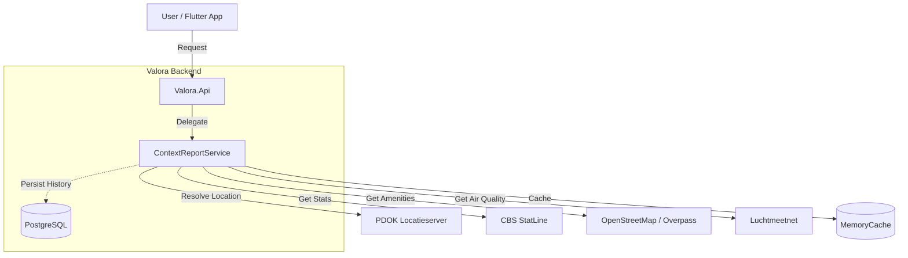

# Valora

Valora is a public-context intelligence platform for residential locations in the Netherlands.

The app accepts a listing link or plain address as input, resolves it to a location, and generates a context report using public/open APIs (CBS, PDOK, OSM/Overpass, Luchtmeetnet, and others as configured).

## Project Philosophy

Valora is built on the principle of **Public-Context Intelligence**.

*   **No Scraping**: We do not harvest *external* listing content. Listing links are treated merely as location hints.
*   **On-Demand Enrichment**: Context reports are generated in real-time by querying public APIs.
*   **Explainable Scoring**: Every score (Social, Amenity, Environment) is traceable to raw data points.
*   **Data Persistence**: Valora stores user accounts and may persist user-submitted listings or generated reports for caching and history purposes, but it does not scrape or mass-archive external listing sites.

## High-Level Architecture



## Directory Structure

*   `apps/flutter_app`: The Flutter frontend application.
*   `backend`: The .NET 10 backend solution following Clean Architecture.
    *   `Valora.Api`: Minimal API entry points.
    *   `Valora.Application`: Core business logic and interfaces.
    *   `Valora.Domain`: Pure domain entities.
    *   `Valora.Infrastructure`: External integrations (EF Core, API clients).
*   `docker`: Docker Compose configuration for local development.
*   `docs`: Detailed documentation for developers and users.

## Quick Start

### Prerequisites

Ensure you have the following installed:

*   **Docker Desktop**: Required for the database.
    *   Verify: `docker --version`
*   **.NET 10 SDK**: Required for the backend.
    *   Verify: `dotnet --version`
*   **Flutter SDK**: Required for the frontend.
    *   Verify: `flutter --version`

### 1. Start Infrastructure

Start the PostgreSQL database:

```bash
docker-compose -f docker/docker-compose.yml up -d
```

*Troubleshooting*: If you see "Port already in use", check if another Postgres instance is running on port 5432. You can stop it or change the port mapping in `docker-compose.yml`.

### 2. Run Backend

Navigate to the backend directory and start the API:

```bash
cd backend
cp .env.example .env
dotnet run --project Valora.Api
```

*Verify*: Open http://localhost:5001/api/health in your browser. You should see `{"status":"healthy"}`.

### 3. Run Frontend

Open a new terminal, navigate to the app directory, and run the Flutter app:

```bash
cd apps/flutter_app
cp .env.example .env
flutter pub get
flutter run
```

## Configuration and API Keys

### Backend (`backend/.env`)

Required for local run:

- `DATABASE_URL`
- `JWT_SECRET`
- `JWT_ISSUER`
- `JWT_AUDIENCE`

Optional (feature-dependent):

- `OPENROUTER_API_KEY`: only required when using `/api/ai/chat`
- `OPENROUTER_MODEL`
- `OPENROUTER_BASE_URL`
- `OPENROUTER_SITE_URL`
- `OPENROUTER_SITE_NAME`

Optional source overrides (default public endpoints are already set in `.env.example`):

- `CONTEXT_PDOK_BASE_URL`
- `CONTEXT_CBS_BASE_URL`
- `CONTEXT_OVERPASS_BASE_URL`
- `CONTEXT_LUCHTMEETNET_BASE_URL`

Optional cache tuning:

- `CONTEXT_RESOLVER_CACHE_MINUTES`
- `CONTEXT_CBS_CACHE_MINUTES`
- `CONTEXT_AMENITIES_CACHE_MINUTES`
- `CONTEXT_AIR_CACHE_MINUTES`
- `CONTEXT_REPORT_CACHE_MINUTES`

### Frontend (`apps/flutter_app/.env`)

- `API_URL` (required)
- `SENTRY_DSN` (optional)

## Core API Endpoints

| Method | Endpoint | Auth | Description |
|---|---|---|---|
| `GET` | `/api/health` | No | Service + DB connectivity check |
| `POST` | `/api/auth/register` | No | Register user |
| `POST` | `/api/auth/login` | No | Login and receive JWT |
| `POST` | `/api/auth/refresh` | No | Refresh token |
| `POST` | `/api/context/report` | Yes | Generate enrichment report from link/address |

## Architecture Details

Valora follows **Clean Architecture**:

- **Valora.Domain**: Entities and core business concepts (e.g., `ContextReport`, `User`). No external dependencies.
- **Valora.Application**: Interfaces (`IContextReportService`), DTOs, and Use Cases. Depends only on Domain.
- **Valora.Infrastructure**: Implementation of interfaces (EF Core, `PdokLocationResolver`, `CbsNeighborhoodStatsClient`). Depends on Application.
- **Valora.Api**: Entry point, Controllers/Endpoints, Middleware. Depends on Application and Infrastructure.

## Documentation

*   [Onboarding Guide](docs/onboarding.md) - detailed setup and walkthrough.
*   [Developer Guide](docs/developer-guide.md) - API reference and internals.
*   [User Guide](docs/user-guide.md) - how to use the app.
*   [Architecture Overview](docs/architecture.md) - deep dive into the system design.
