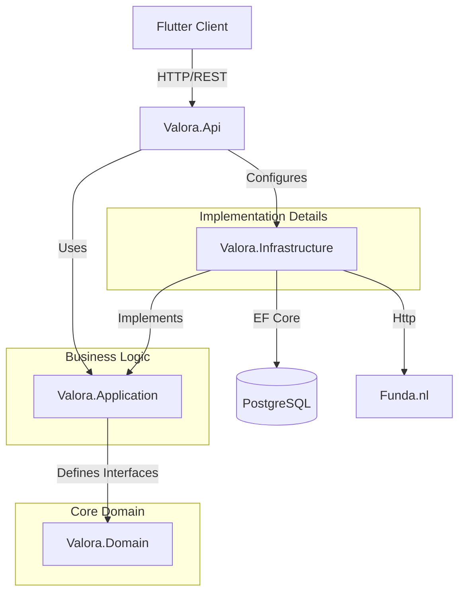
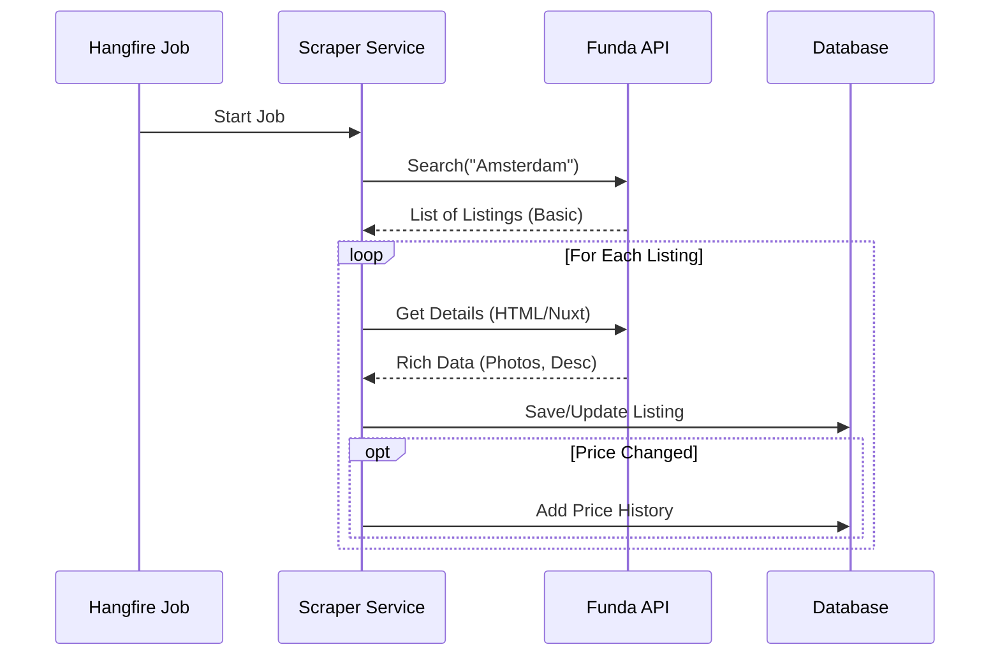

# Valora 🏠

**Valora** is a powerful, self-hosted real estate tracker for [funda.nl](https://www.funda.nl). It automates the search for your dream home by scraping listings, enriching them with detailed data, and tracking price changes over time.

> **Mission:** Ensure every developer understands exactly how this system works within 10 minutes.

---

## 🏁 Start Here

New to the project? **Read the [Onboarding Guide](docs/onboarding.md) first.**

It contains:
- A "First 10 Minutes" checklist.
- Detailed data flow diagrams.
- Instructions for your first contribution.

---

## 🚀 Quick Start (5 Minutes)

Get the system running locally to see it in action.

### Prerequisites
- Docker Desktop
- .NET 10 SDK (Backend)
- Flutter SDK (Frontend)

### 1. Start Infrastructure
Launch PostgreSQL and Redis (if used) via Docker Compose.
```bash
docker-compose -f docker/docker-compose.yml up -d
```

### 2. Run Backend
The API handles scraping, data persistence, and business logic.
```bash
cd backend
cp .env.example .env
dotnet run --project Valora.Api
```
*Server starts at `http://localhost:5000`*

### 3. Run Frontend
The Flutter app provides a beautiful interface to view and manage listings.
```bash
cd apps/flutter_app
cp .env.example .env
flutter pub get
flutter run
```

---

## 🗺️ Project Map

Where everything lives.

```
valora/
├── apps/
│   └── flutter_app/       # 📱 Frontend: Flutter application (Web/Mobile/Desktop)
├── backend/               # ⚙️ Backend: .NET 10 Solution
│   ├── Valora.Api/            # Entry Point: Configuration, Endpoints, DI
│   ├── Valora.Application/    # Core Logic: Interfaces, Use Cases, DTOs
│   ├── Valora.Domain/         # Business Rules: Entities (Listing, PriceHistory)
│   ├── Valora.Infrastructure/ # Heavy Lifting: EF Core, Scraper, Funda API Client
│   └── Valora.UnitTests/      # Verification: Unit tests
├── docker/                # 🐳 Infrastructure: Docker Compose files
└── docs/                  # 📚 Documentation: Guides and reference
```

---

## 🏗️ Architecture Overview

Valora follows **Clean Architecture** principles to keep the core logic independent of external frameworks.



- **Domain**: Pure C# classes. No dependencies.
- **Application**: The "What". Defines *what* the system does (interfaces).
- **Infrastructure**: The "How". Implements the interfaces (scraping, database).
- **API**: The "Entry". Wires everything together.

---

## ⚙️ How it Works

The system operates in two main modes.

### 1. The Scraper Loop (Write)
A background job (`FundaScraperJob`) runs periodically to fetch and update listings.



1.  **Search**: Queries Funda's hidden API for listings in target regions.
2.  **Filter**: Identifies new or updated listings.
3.  **Enrich**: Fetches detailed data (photos, description, broker info) by parsing the listing's HTML page (specifically the Nuxt.js hydration state).
4.  **Store**: Saves the rich data to PostgreSQL.

### 2. The User Loop (Read)
The user interacts with the Flutter app:
1.  **Request**: App sends `GET /api/listings`.
2.  **Query**: API queries the database using efficient filters.
3.  **Response**: Returns a lightweight summary of listings.

---

## 📡 Key API Endpoints

The backend exposes a REST API built with .NET Minimal APIs.

| Method | Endpoint | Auth | Description |
|--------|----------|------|-------------|
| `GET` | `/api/listings` | 🔒 | Get paginated, filtered listings. |
| `GET` | `/api/listings/{id}` | 🔒 | Get full details for a single listing. |
| `POST` | `/api/scraper/trigger` | 🔒 | Manually trigger a full scrape (Admin only). |
| `POST` | `/api/auth/login` | 🔓 | Authenticate and receive JWT token. |
| `GET` | `/api/health` | 🔓 | Check system status. |

See [Developer Guide](docs/developer-guide.md) for full API documentation.

---

## 📚 Documentation

Dive deeper into specific topics:

- **[Onboarding Guide](docs/onboarding.md)**: Detailed data flow walkthroughs and first-day tasks.
- **[Developer Guide](docs/developer-guide.md)**: Deep dive into technical decisions and patterns.
- **[User Guide](docs/user-guide.md)**: How to use the application features.

## 🛠️ Key Commands

| Action | Command |
|--------|---------|
| **Run Tests** | `dotnet test backend/Valora.UnitTests` |
| **Add Migration** | `dotnet ef migrations add <Name> --project Valora.Infrastructure --startup-project Valora.Api` |
| **Update DB** | `dotnet ef database update --project Valora.Infrastructure --startup-project Valora.Api` |
| **Trigger Scrape** | `POST /api/scraper/trigger` (via Postman/Curl) |

---

*Made with ❤️ by the Valora Team.*
