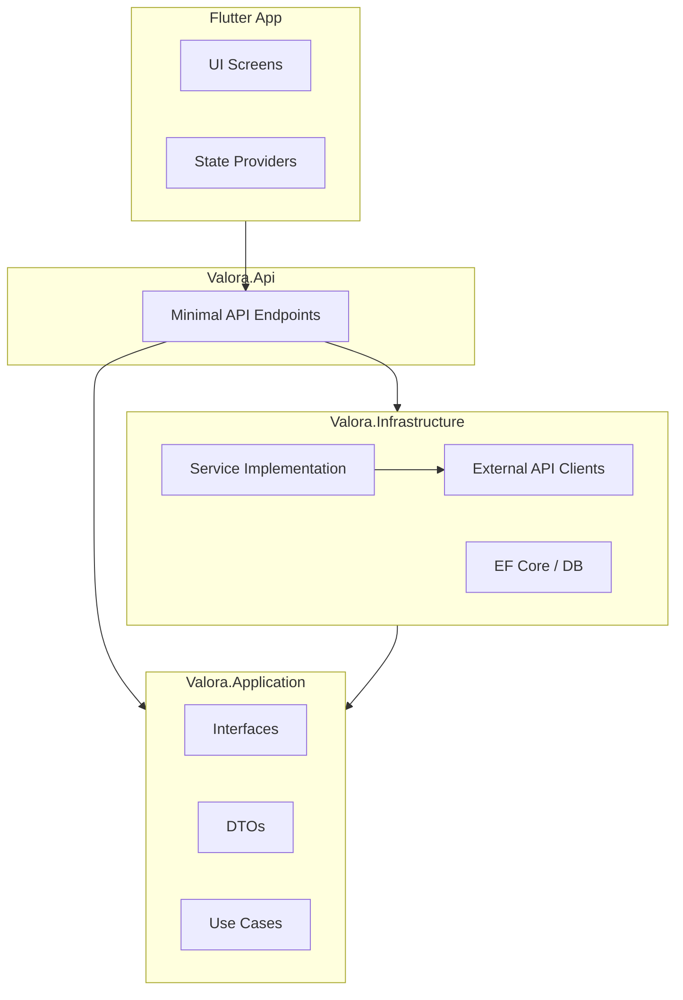

# Valora

Valora is a public-context intelligence platform for residential locations in the Netherlands.

The app accepts a listing link or plain address as input, resolves it to a location, and generates a context report using public/open APIs (CBS, PDOK, OSM/Overpass, Luchtmeetnet, and others as configured).

## Product Direction

- Input: listing URL or address text
- Resolution: normalized address + coordinates + admin codes
- Enrichment: public API connectors queried on demand
- Output: explainable context report (social, amenities, environment, accessibility-ready)

## Documentation

- **[Onboarding Guide](docs/onboarding.md)**: Get started in 10 minutes.
- **[Data Flow Deep Dive](docs/onboarding-data-flow.md)**: Understand how a request becomes a report.
- **[Developer Guide](docs/developer-guide.md)**: Architecture, testing, and coding standards.
- **[User Guide](docs/user-guide.md)**: How to use the application.

## Architecture

Valora follows Clean Architecture principles to separate concerns and maintain testability.



### Layer Responsibilities

- **Valora.Domain**: Core entities and business rules (e.g., `Listing`, `Report`). No external dependencies.
- **Valora.Application**: Use case definitions, interfaces (e.g., `IContextReportService`), and DTOs. Defines *what* the system does.
- **Valora.Infrastructure**: Implementations of interfaces (e.g., `ContextReportService`, EF Core repositories, HTTP clients for CBS/PDOK). Defines *how* it works.
- **Valora.Api**: Entry point, dependency injection wiring, and HTTP routing.

## Project Structure

```
├── apps/
│   └── flutter_app/       # Mobile application (Flutter)
├── backend/
│   ├── Valora.Api/        # API entry point
│   ├── Valora.Application/# Core logic & interfaces
│   ├── Valora.Domain/     # Entities & business rules
│   └── Valora.Infrastructure/ # Database & external services
├── docker/                # Docker compose files
├── docs/                  # Documentation
└── verification/          # Scripts for verifying changes
```

## Data Sources

Valora aggregates data from several Dutch open data providers:

| Source | Purpose | URL |
|---|---|---|
| **PDOK Locatieserver** | Address resolution & geocoding | `api.pdok.nl` |
| **CBS StatLine** | Neighborhood statistics (income, demographics, crime) | `opendata.cbs.nl` |
| **OpenStreetMap (Overpass)** | Amenities (shops, schools, parks, transit) | `overpass-api.de` |
| **Luchtmeetnet** | Air quality (PM2.5) | `api.luchtmeetnet.nl` |

## Setup & Configuration

### Prerequisites
- Docker Desktop
- .NET 10 SDK
- Flutter SDK

### Environment Variables

Copy `.env.example` to `.env` in `backend/` and `apps/flutter_app/`.

#### Backend (`backend/.env`)

| Variable | Description | Required? |
|---|---|---|
| `DATABASE_URL` | PostgreSQL connection string | **Yes** |
| `JWT_SECRET` | Secret key for signing JWT tokens | **Yes** |
| `JWT_ISSUER` | Token issuer claim (e.g., `ValoraApi`) | **Yes** |
| `JWT_AUDIENCE` | Token audience claim (e.g., `ValoraApp`) | **Yes** |
| `OPENROUTER_API_KEY` | Key for AI Chat features (optional) | No |
| `CONTEXT_*_CACHE_MINUTES` | Cache duration for external data sources | No (Defaults exist) |

#### Frontend (`apps/flutter_app/.env`)

| Variable | Description | Required? |
|---|---|---|
| `API_URL` | URL of the backend API (e.g., `http://localhost:5001/api`) | **Yes** |

### Quick Start

1.  **Infrastructure:** Start the database and redis (if configured).
    ```bash
    docker-compose -f docker/docker-compose.yml up -d
    ```

2.  **Backend:** Configure and run the API.
    ```bash
    cd backend
    dotnet run --project Valora.Api
    ```
    *Verify:* `curl http://localhost:5001/api/health`

3.  **Frontend:** Configure and run the mobile app.
    ```bash
    cd apps/flutter_app
    flutter pub get
    flutter run
    ```

## API Reference

| Method | Endpoint | Auth | Description |
|---|---|---|---|
| `GET` | `/api/health` | No | Service + DB connectivity check |
| `POST` | `/api/auth/register` | No | Register user |
| `POST` | `/api/auth/login` | No | Login and receive JWT |
| `POST` | `/api/context/report` | **Yes** | Generates a context report from an address or Funda URL. |
| `POST` | `/api/listings/{id}/enrich` | **Yes** | Updates an existing listing entity with fresh context data. |

> **Note:** The `/api/context/report` endpoint is the core of the application. It aggregates data from 5+ external sources in parallel using a fan-out pattern.
