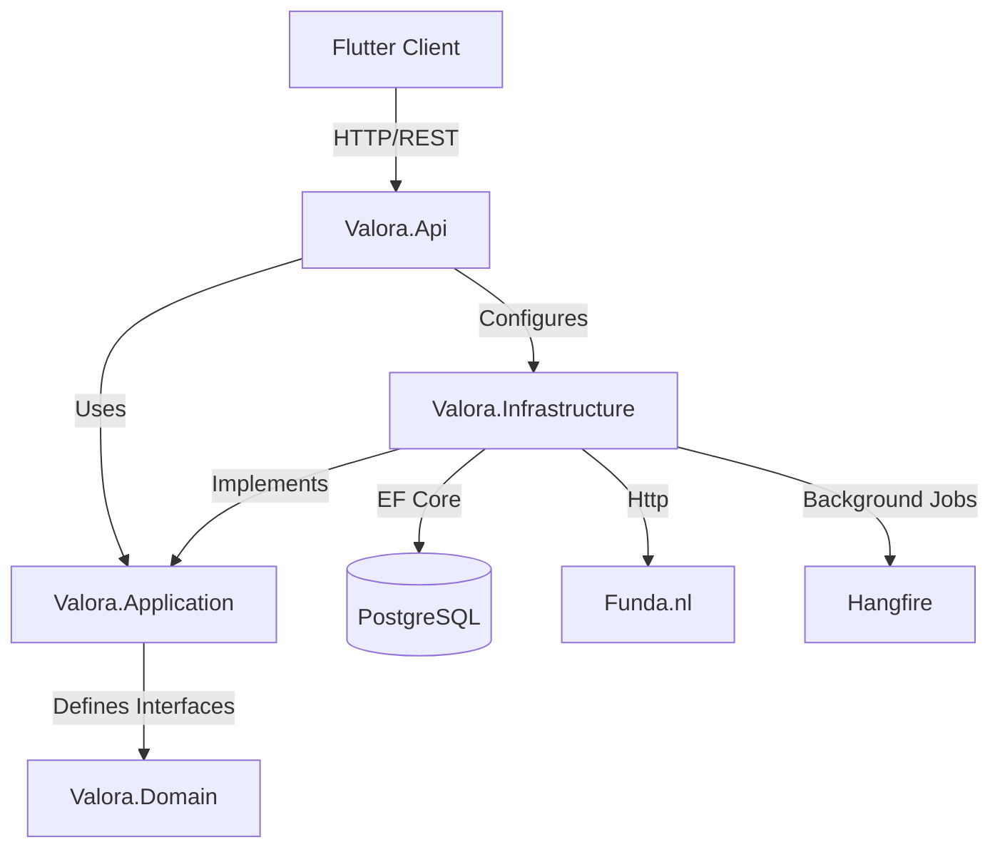

# Valora

Valora is a powerful real estate scraper and dashboard for [funda.nl](https://www.funda.nl), built with a modern Clean Architecture stack. It automates the tracking of property listings, providing enriched data insights that the standard Funda interface doesn't offer.

## 🏗️ Architecture

Valora follows **Clean Architecture** principles to ensure scalability, testability, and maintainability.



### Layers
- **Valora.Domain**: The heart of the system. Contains entities like `Listing` and `PriceHistory`. No external dependencies.
- **Valora.Application**: Orchestrates business logic (Use Cases). Defines interfaces (`IListingRepository`, `IScraperService`) that the Infrastructure layer must implement.
- **Valora.Infrastructure**: The machinery. Implements interfaces using concrete technologies:
    - **EF Core** for PostgreSQL access.
    - **HttpClient** with **Polly** for resilient scraping.
    - **Hangfire** for background job scheduling.
- **Valora.Api**: The entry point. A .NET 10 Minimal API that wires everything together using Dependency Injection.

## 🔄 Data Flow

### Request Lifecycle
1. **Client Request**: Flutter app sends a `GET /api/listings` request with filters.
2. **API Endpoint**: `Valora.Api` receives the request and maps parameters to a `ListingFilterDto`.
3. **Application Logic**: The endpoint calls `IListingRepository.GetAllAsync(filter)`.
4. **Infrastructure Execution**: The repository translates the filter into an optimized SQL query and executes it against PostgreSQL.
5. **Response**: Data is returned as JSON to the client.

### Scraping Workflow
1. **Trigger**: A Hangfire job triggers `FundaScraperService.ScrapeAndStoreAsync()`.
2. **Search**: The service calls Funda's internal APIs to find listings matching your criteria.
3. **Enrichment**: For each listing, Valora performs a 4-step enrichment process:
   - **Summary API**: Basic details.
   - **Nuxt Hydration**: Extracts rich data (descriptions, full features) embedded in the HTML.
   - **Contact API**: Fetches broker details.
   - **Fiber API**: Checks internet availability.
4. **Persistence**: Data is saved or updated in the database, with price changes recorded in `PriceHistory`.

See the [Developer Guide](docs/developer-guide.md) for detailed sequence diagrams.

## 🚀 Getting Started

### Prerequisites
- **[.NET 10 SDK](https://dotnet.microsoft.com/download/dotnet/10.0)**: Verify with `dotnet --version`.
- **[Flutter SDK](https://docs.flutter.dev/get-started/install)**: Verify with `flutter doctor`.
- **[Docker Desktop](https://www.docker.com/products/docker-desktop)**: Verify with `docker --version`.

### 1. Database Setup
Start the PostgreSQL database and Hangfire dashboard:

```bash
docker-compose -f docker/docker-compose.yml up -d
```

### 2. Backend Setup
Configure the backend environment:

```bash
cd backend
cp .env.example .env
# Edit .env and set a secure JWT_SECRET
```

Run the API:

```bash
dotnet restore
dotnet build
dotnet run --project Valora.Api
```
*The server will start at `http://localhost:5000`.*

### 3. Frontend Setup
Configure the Flutter app:

```bash
cd apps/flutter_app
cp .env.example .env
# Ensure API_URL points to http://localhost:5000
```

Run the app:

```bash
flutter pub get
flutter run
```

## 📚 API Reference

| Method | Endpoint | Description | Auth |
|--------|----------|-------------|------|
| `GET` | `/api/health` | System health check | ❌ |
| `POST` | `/api/auth/login` | Authenticate & get JWT | ❌ |
| `POST` | `/api/auth/register` | Create account | ❌ |
| `GET` | `/api/listings` | Search listings | ✅ |
| `GET` | `/api/listings/{id}` | Detailed listing view | ✅ |
| `POST` | `/api/scraper/trigger` | Manually run scraper | ✅ |

For full documentation, see [Developer Guide](docs/developer-guide.md).

## 🔧 Troubleshooting

### Database Connection Failed
- **Error**: `Npgsql.NpgsqlException: Connection refused`
- **Fix**: Ensure Docker is running. If running the backend locally (outside Docker), make sure `localhost` in your connection string points to the Docker mapped port (usually 5432).

### Scraper Not Finding Listings
- **Error**: "Found 0 listings"
- **Fix**: Check your `SCRAPER_SEARCH_URLS` in `.env`. They must be valid Funda search URLs (e.g., `https://www.funda.nl/koop/amsterdam/`). Ensure you are not being rate-limited (check logs for 429/403).

### JWT Errors
- **Error**: `IDX10000: The parameter 'key' cannot be null`
- **Fix**: You forgot to set `JWT_SECRET` in `backend/.env`. It must be at least 32 characters long.

## 🤝 Contributing

1. Fork the repository.
2. Create a feature branch (`git checkout -b feature/amazing-feature`).
3. Commit your changes.
4. Run tests:
   - Backend: `dotnet test backend/`
   - Frontend: `flutter test apps/flutter_app/`
5. Open a Pull Request.

---
*Documentation maintained by the Valora team.*
