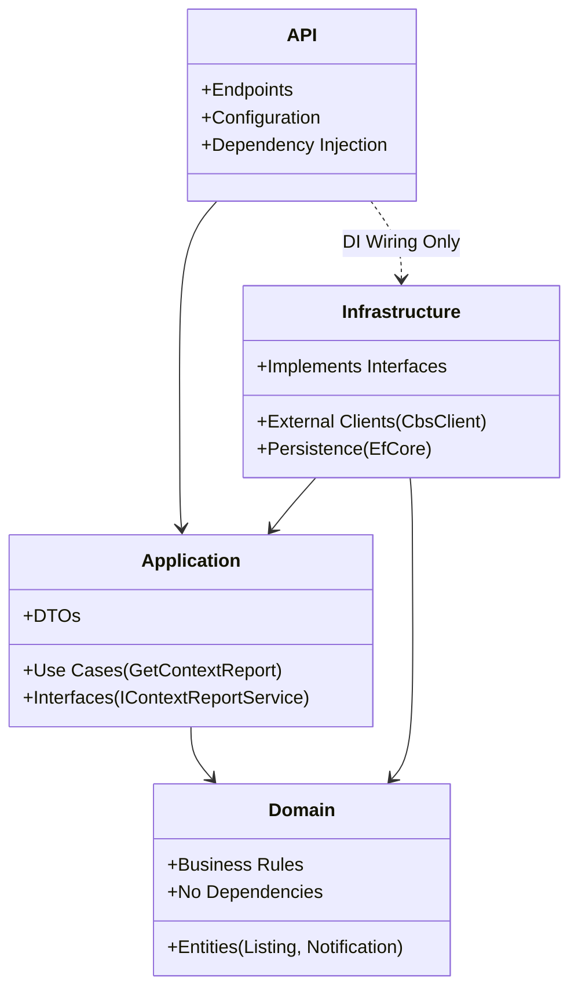
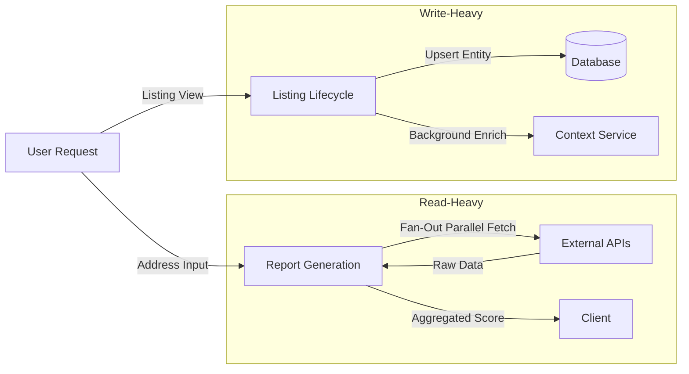

# Valora

Valora is a public-context intelligence platform for residential locations in the Netherlands.

It helps users understand the "vibe" and statistics of a neighborhood by aggregating data from public sources (CBS, PDOK, OpenStreetMap, Luchtmeetnet) into a unified, explainable context report.

## 🚀 Start Here

> **[Get Started in 10 Minutes](docs/onboarding.md)**: Follow the step-by-step onboarding guide to set up your environment and run the app.

### Quick Troubleshooting
- **Backend won't start?** Check if you created `backend/.env` with a `JWT_SECRET`.
- **Database error?** Ensure Docker is running: `docker-compose -f docker/docker-compose.yml up -d`.
- **App can't connect?** Android Emulator needs `API_URL=http://10.0.2.2:5001/api`.

---

## System Context

Valora acts as an intelligent aggregator between the user and Dutch open data ecosystems.

```mermaid
graph TD
    User((User)) -->|Input Address/URL| App[Flutter App]
    Admin((Admin)) -->|Manage| AdminApp[Admin Dashboard]
    App -->|API Request| Backend[Valora Backend]
    AdminApp -->|API Request| Backend

    subgraph "External Data Sources"
        Backend -->|Geocoding| PDOK[PDOK Locatieserver]
        Backend -->|Demographics/Crime| CBS[CBS StatLine]
        Backend -->|Amenities| OSM[OpenStreetMap (Overpass)]
        Backend -->|Air Quality| Air[Luchtmeetnet]
    end

    Backend -->|Persist| DB[(PostgreSQL)]
    Backend -->|Cache| Cache[(Memory/Redis)]
```

## Architecture

Valora follows **Clean Architecture** principles to separate concerns and maintain testability.



### Layer Responsibilities

-   **Valora.Domain**: Core entities and business rules. The heart of the system. Has **zero dependencies**.
-   **Valora.Application**: Defines *what* the system does (Interfaces, Use Cases). Depends only on Domain.
-   **Valora.Infrastructure**: Defines *how* it works (External APIs, Database). Implements Application interfaces.
-   **Valora.Api**: The entry point. Wires everything together and handles HTTP requests.

**Why this architecture?**
1.  **Testability**: We can unit test the core logic (Application/Domain) without spinning up a database or calling external APIs.
2.  **Modularity**: We can swap out the Geocoder or Database implementation in `Infrastructure` without touching the business logic.
3.  **Safety**: The Domain layer enforces invariants that the API layer cannot bypass.

## Data Flow

Valora processes data in two main pipelines. Click the links for deep dives.



1.  **[Report Generation Data Flow](docs/onboarding-data-flow.md)**: How we fetch, aggregate, and score data from 4+ sources in parallel.
2.  **[Listing Lifecycle Data Flow](docs/data-flow-lifecycle.md)**: How we discover, persist, and enrich property listings.

## Documentation Index

-   **[Onboarding Guide](docs/onboarding.md)**: Setup instructions.
-   **[API Reference](docs/api-reference.md)**: Detailed API documentation.
-   **[Developer Guide](docs/developer-guide.md)**: Coding standards, patterns, and testing.
-   **[User Guide](docs/user-guide.md)**: App features walkthrough.
-   **[Admin App Guide](apps/admin_page/README.md)**: Setup and features for the admin dashboard.

## Quick Setup

### Prerequisites
-   Docker Desktop
-   .NET 10 SDK
-   Flutter SDK
-   Node.js 18+ (for Admin App)

### 1. Infrastructure
```bash
docker-compose -f docker/docker-compose.yml up -d
```

### 2. Backend
```bash
cd backend
cp .env.example .env  # CRITICAL: Configure JWT_SECRET and DATABASE_URL
dotnet run --project Valora.Api
```

### 3. Frontend (Mobile)
```bash
cd apps/flutter_app
cp .env.example .env  # CRITICAL: Set API_URL (use 10.0.2.2 for Android Emulator)
flutter pub get
flutter run
```

### 4. Admin Dashboard (Web)
```bash
cd apps/admin_page
cp .env.example .env
npm install
npm run dev
```

## API Reference

| Method | Endpoint | Description |
|---|---|---|
| `POST` | `/api/context/report` | **Core:** Generate report from address/URL. |
| `POST` | `/api/listings/{id}/enrich` | Update listing with context data. |
| `POST` | `/api/auth/login` | Authenticate user. |

See [API Reference](docs/api-reference.md) for full details.
