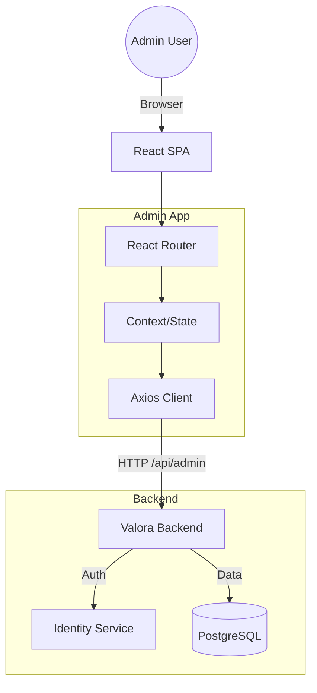

# Valora Admin Dashboard

The Admin Dashboard is a React-based web application for managing the Valora platform. It provides tools for user management, system monitoring, and listing oversight.

## 🚀 Features

-   **User Management**: View, delete, and manage user roles (Admin/User).
-   **System Statistics**: Real-time counts of users, listings, and notifications.
-   **Listing Oversight**: View enriched listings and their context scores (planned).
-   **Secure**: Protected by JWT authentication and "Admin" role policy.

## Architecture

The Admin App is a Single Page Application (SPA) built with Vite and React. It communicates with the Valora Backend API.



## Setup & Run

### Prerequisites
- Node.js 18+
- Valora Backend running (default: `http://localhost:5001`)

### 1. Configuration
Copy the example environment file:

```bash
cp .env.example .env
```

Edit `.env` and set the API URL:
```ini
VITE_API_URL=http://localhost:5001/api
```
*Note: Ensure the port matches your backend configuration.*

### 2. Install Dependencies
```bash
npm install
```

### 3. Run Development Server
```bash
npm run dev
```
Access the dashboard at `http://localhost:5173`.

## Project Structure

-   `src/components`: Reusable UI components (Cards, Tables, etc.).
-   `src/pages`: Top-level page views (Dashboard, Users, Login).
-   `src/services`: API client and endpoint definitions.
-   `src/context`: React Context for global state (Auth).

## Testing

Run the test suite:

```bash
npm test
```
