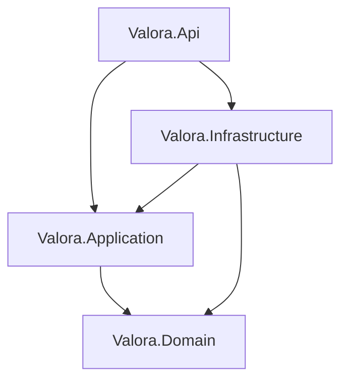

# Valora Backend

.NET 10 backend for location context enrichment.

## Architecture Overview

The backend follows Clean Architecture principles, ensuring separation of concerns:
- **Domain**: Core business logic and entities. No dependencies.
- **Application**: Use cases and interfaces (MediatR pattern).
- **Infrastructure**: External API clients, database access (EF Core), and third-party services.
- **Api**: The presentation layer containing minimal APIs and dependency injection setup.



## Setup Instructions

1. Ensure you have the .NET 10 SDK installed and Docker running (for PostgreSQL).
2. Start the database by running `docker-compose -f ../docker/docker-compose.yml up -d` from the root directory.
3. Clone the `.env.example` file and configure your local settings:
```bash
cd backend
cp .env.example .env
```
4. Configure required `.env` keys, notably `DATABASE_URL` and `JWT_SECRET`.
5. Run the application:
```bash
dotnet run --project Valora.Api
```

## API Reference

The backend exposes a RESTful API:
- `POST /api/auth/login`: Authenticate users.
- `POST /api/context/report`: Generate a context report by fanning out requests to multiple external APIs concurrently.
- `GET /api/map/cities`: Retrieve city-level insights and map data.
- `POST /api/workspaces`: Manage user workspaces.

For complete documentation on all endpoints, please refer to the main `docs/api-reference.md`.

## Test

```bash
cd backend
dotnet test
```

Integration tests are configured for EF Core InMemory in this environment.

## Projects

- `Valora.Api`
- `Valora.Application`
- `Valora.Domain`
- `Valora.Infrastructure`
- `Valora.UnitTests`
- `Valora.IntegrationTests`
