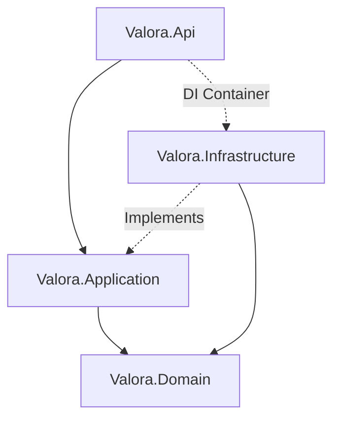

# Valora Backend

.NET 10 backend for location context enrichment.

## Architecture Overview

The Valora backend strictly adheres to Clean Architecture to segregate concerns. External implementations (e.g., Database, APIs) are decoupled from the core business logic.



### Setup Instructions (Quick Start)

To run the backend locally:

1.  **Prerequisites:** Install .NET 10 SDK and ensure a PostgreSQL instance is running (e.g., via Docker).
2.  **Configuration:**
    Copy the `.env.example` file and configure your secrets.
    ```bash
    cp .env.example .env
    ```
    Required `.env` keys:
    - `DATABASE_URL`
    - `JWT_SECRET`, `JWT_ISSUER`, `JWT_AUDIENCE`

3.  **Run:**
    ```bash
    dotnet run --project Valora.Api
    ```
4.  **Test:**
    ```bash
    dotnet test Valora.slnx
    ```
    Integration tests use EF Core InMemory.

## API Reference
Here are the primary endpoints exposed by `Valora.Api`.

*   **Auth**
    *   `POST /api/auth/login` - Authenticates a user.
    *   `POST /api/auth/register` - Registers a new user.
*   **Context**
    *   `POST /api/context/report` - Aggregates context data for a location (Fan-Out strategy).
*   **AI Chat**
    *   `POST /api/ai/chat` - Generates insights via OpenRouter.
*   **Jobs (Admin)**
    *   `POST /api/admin/jobs` - Queues background ingestion jobs.

## Responsibilities
- Error tracking and performance monitoring (Sentry)
- Authentication and authorization
- Context report generation (`/api/context/report`)
- Persistence layer (EF Core/PostgreSQL)
- Public API connector orchestration

## Projects

- `Valora.Api`: Minimal APIs and DI Registration.
- `Valora.Application`: Core use cases, Fan-Out orchestration, DTOs.
- `Valora.Domain`: Enterprise business rules, domain entities, value objects.
- `Valora.Infrastructure`: Repositories (CQRS-lite), external API clients.
- `Valora.UnitTests`
- `Valora.IntegrationTests`
