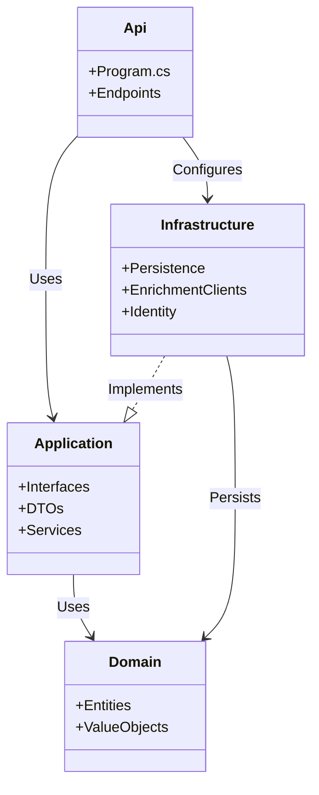
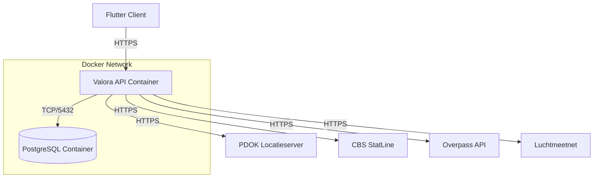

# Valora Architecture

Valora follows a strict **Clean Architecture** pattern to separate concerns and ensure maintainability.

## Architectural Layers

The solution is divided into four main projects:

1.  **Valora.Domain**
    *   **Role**: The core of the application. Contains enterprise business logic and entities.
    *   **Dependencies**: None. Pure C# classes.
    *   **Examples**: `User`, `Listing`, `ContextReport`, Value Objects.

2.  **Valora.Application**
    *   **Role**: Orchestrates the flow of data. Defines interfaces (ports) and use cases.
    *   **Dependencies**: Only depends on `Valora.Domain`.
    *   **Examples**: `IContextReportService`, `ILocationResolver`, DTOs (`ContextReportDto`), Command/Query handlers.

3.  **Valora.Infrastructure**
    *   **Role**: Implements the interfaces defined in `Valora.Application`. Handles external concerns like database access, file systems, and external APIs.
    *   **Dependencies**: Depends on `Valora.Application`. references external libraries (EF Core, HTTP Client, etc.).
    *   **Examples**: `ValoraDbContext`, `PdokLocationResolver`, `CbsNeighborhoodStatsClient`.

4.  **Valora.Api**
    *   **Role**: The entry point of the application. Handles HTTP requests, authentication, and dependency injection composition.
    *   **Dependencies**: Depends on `Valora.Application` and `Valora.Infrastructure`.
    *   **Examples**: `Program.cs`, Endpoints (`MapPost("/api/context/report")`), Middleware.

## Layer Dependencies

## Deployment View

The application is containerized using Docker.

## Key Components

### Context Report Service (`Valora.Application.Enrichment.ContextReportService`)
This service is the heart of the enrichment logic. It orchestrates calls to multiple external providers (PDOK, CBS, OSM, Luchtmeetnet) to gather data about a location. It then normalizes this data into a standardized `ContextReportDto` with scores for Social, Amenity, and Environment metrics.

### Location Resolver (`Valora.Infrastructure.Enrichment.PdokLocationResolver`)
Responsible for converting user input (address or listing URL) into a precise geographic location (Latitude/Longitude) and administrative context (Municipality, Neighborhood codes). It handles the normalization of input strings to ensure reliable querying against the PDOK Locatieserver.

### Data Persistence (`Valora.Infrastructure.Persistence.ValoraDbContext`)
Uses Entity Framework Core to persist user data, saved reports, and listings. In development, it connects to a local PostgreSQL container. In testing, it uses the In-Memory provider for speed and isolation.
