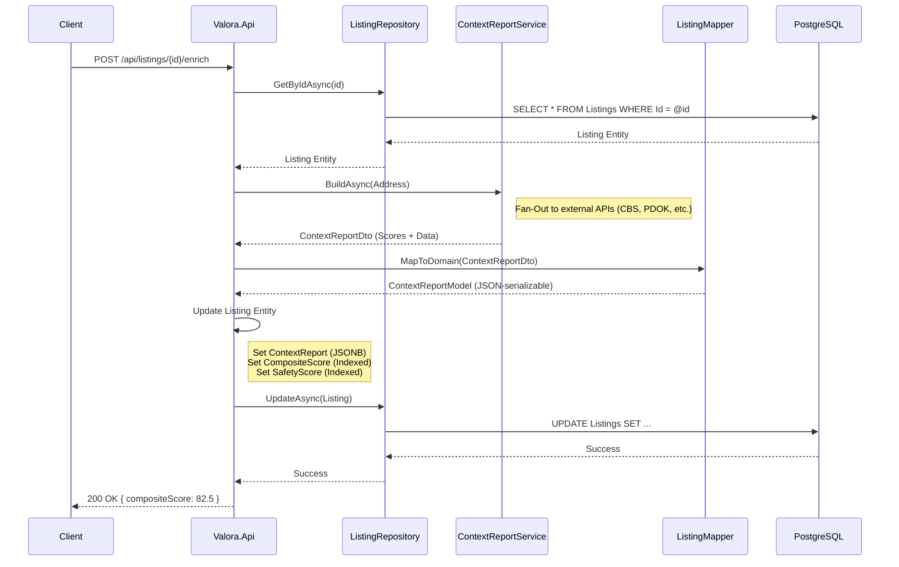

# Data Flow: Listing Enrichment & Persistence

This guide explains the "Enrichment" process, where an existing real estate listing in the database is enhanced with contextual data (crime, social, amenities) and persisted for future querying. This differs from the on-demand report generation which is ephemeral.

## Overview

The enrichment process is triggered via `POST /api/listings/{id}/enrich`. It transforms a raw listing (address only) into a "smart" listing with a comprehensive context report and computed scores.

### Key Actors
- **Client (Flutter App/Admin):** Initiates the enrichment request.
- **Valora.Api:** Handles the request and orchestrates the service calls.
- **ListingRepository:** Retrieves the listing and saves the updated entity.
- **ContextReportService:** Generates the report using external data sources (fan-out).
- **ListingMapper:** Maps the Application DTO (`ContextReportDto`) to the Domain Value Object (`ContextReportModel`).
- **Database:** Stores the enriched listing as a JSONB column and indexed score columns.

## Sequence Diagram

## Detailed Steps

### 1. Retrieval
The API first retrieves the target listing using `ListingRepository.GetByIdAsync`. This ensures we are operating on a valid, existing entity.

### 2. Report Generation
The `ContextReportService.BuildAsync` method is called with the listing's address. This triggers the standard fan-out process described in [Onboarding Data Flow](onboarding-data-flow.md) to fetch data from CBS, PDOK, and OSM.

### 3. Domain Mapping
The service returns a `ContextReportDto` (optimized for API responses). However, our Domain entity `Listing` stores the report as a structured JSON object (`ContextReportModel`). The `ListingMapper` handles this conversion, stripping unnecessary metadata if needed.

### 4. Entity Update & Indexing
The API updates the `Listing` entity with two types of data:
- **Rich Data (JSONB):** The full report is stored in the `ContextReport` column (PostgreSQL JSONB). This allows the frontend to render detailed charts without re-fetching external APIs.
- **Indexed Scores (Columns):** Key scores like `ContextCompositeScore` and `ContextSafetyScore` are copied to dedicated numeric columns. This enables high-performance filtering and sorting (e.g., "Find apartments with Safety Score > 80").

### 5. Persistence
The `ListingRepository.UpdateAsync` method saves the changes. EF Core detects the modified properties and generates an optimized SQL `UPDATE` statement.
