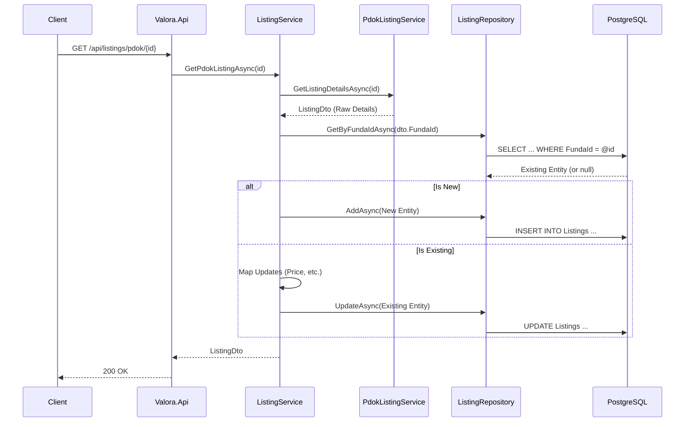
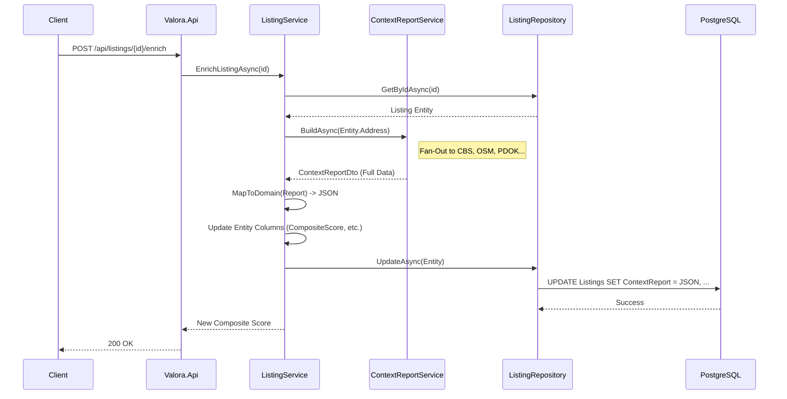

# Data Flow: Listing Lifecycle

This guide explains the complete lifecycle of a listing in Valora, from initial discovery via PDOK to detailed context enrichment and database persistence.

## 1. Creation & Upsert (The "Discovery" Phase)

When a user or admin requests a listing by its external ID (e.g., PDOK ID or Funda URL), the system ensures it exists in our database.

### The Flow
1.  **Request**: `GET /api/listings/pdok/{id}`
2.  **External Fetch**: `PdokListingService` queries the PDOK Locatieserver for raw details.
3.  **Upsert Logic**: `ListingService` checks if a listing with this `FundaId` (or external ID) already exists.
    -   **If New**: Creates a new `Listing` entity.
    -   **If Existing**: Updates the existing entity (last seen date, price, etc.).
4.  **Persistence**: Saves to `Listings` table.

### Sequence Diagram

## 2. Enrichment (The "Intelligence" Phase)

Once a listing exists, it can be "enriched" with Valora's context data (Social, Safety, Amenities). This is often triggered explicitly or lazily.

### The Flow
1.  **Request**: `POST /api/listings/{id}/enrich`
2.  **Retrieval**: `ListingService` fetches the entity from DB.
3.  **Fan-Out**: `ContextReportService` generates a report for the listing's address (see [Report Data Flow](onboarding-data-flow.md)).
4.  **Mapping**: The complex `ContextReportDto` is mapped to a JSON-serializable `ContextReportModel`.
5.  **Indexing**: Key scores (Composite, Safety) are copied to indexed columns for fast filtering.
6.  **Persistence**: The entity is updated with the JSON blob and scores.

### Sequence Diagram

## Key Decisions & "Why"

-   **Upsert on Read**: We update the listing on every fetch (`GetPdokListingAsync`) to ensure our price and status data is as fresh as possible without running background scrapers.
-   **JSONB Storage**: The full context report is stored as JSONB. This allows us to evolve the report structure (add new metrics) without painful schema migrations for every single data point.
-   **Indexed Columns**: While we store the full report in JSON, we duplicate the most important scores (Composite, Safety, Social) into standard columns. This enables SQL-native sorting and filtering (`WHERE ContextSafetyScore > 80`) which would be slow or complex with JSON queries.
