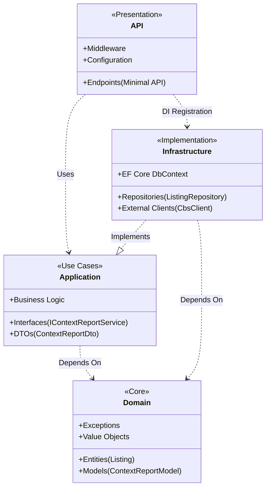

# Valora Developer Guide

## Overview

Valora is an enrichment backend + Flutter client. It does not scrape listing sites. It builds context reports from public APIs at request time.

## Architecture

Valora adheres to **Clean Architecture** to ensure that business logic is independent of frameworks, databases, and external agents.



### Layer Responsibilities

1.  **`Valora.Domain`**
    -   **Role:** The enterprise business rules.
    -   **Dependencies:** None. Pure C#.
    -   **Key Components:** `Listing` (Entity), `ContextReportModel` (Value Object/Model), `Money` (Value Object).

2.  **`Valora.Application`**
    -   **Role:** The application business rules. Orchestrates the flow of data.
    -   **Dependencies:** `Valora.Domain`.
    -   **Key Components:** `IContextReportService`, `IAuthService`, DTOs.

3.  **`Valora.Infrastructure`**
    -   **Role:** The interface adapters. Converts data from the format most convenient for the use cases to the format most convenient for external agencies (DB, Web).
    -   **Dependencies:** `Valora.Application`, `Valora.Domain`.
    -   **Key Components:** `ContextReportService`, `NotificationRepository`, `CbsClient`.

4.  **`Valora.Api`**
    -   **Role:** The framework and drivers.
    -   **Dependencies:** `Valora.Application`, `Valora.Infrastructure` (for DI).

## Key Design Patterns

### 1. Fan-Out / Fan-In (Context Generation)
The `ContextReportService` employs a parallel "Fan-Out" strategy to fetch data from multiple independent sources (CBS, PDOK, Overpass) simultaneously.

-   **Why:** Reduce total latency. The report is as slow as the slowest source, rather than the sum of all sources.
-   **Resilience:** Each source call is wrapped in a `TryGetSourceAsync` block. If a non-critical source (e.g., Luchtmeetnet) fails, the system logs the error and returns a partial report (Fan-In) rather than a 500 error.

### 2. CQRS-Lite (Repositories)
Our repositories explicitly separate read and write concerns for performance:

-   **Reads:** Use `.AsNoTracking()` and projections (`.Select(...)`) to minimize memory usage and avoid change tracking overhead.
-   **Writes:** Use tracked entities for updates or `.ExecuteUpdateAsync` for bulk operations to avoid loading entities into memory at all.

### 3. Strategy Pattern (External Clients)
External data providers are hidden behind Application interfaces (e.g., `ICbsNeighborhoodStatsClient`). This allows us to:
-   Mock these providers easily in tests.
-   Swap implementations (e.g., changing from CBS Open Data v3 to v4) without touching the core logic.

## Context Report Flow

1. Receive input (`address` or `listing link`).
2. Resolve location (PDOK): display address, coordinates, admin codes.
3. Query enrichment clients in parallel (CBS, Overpass, Luchtmeetnet, etc.).
4. Build normalized metrics and composite score.
5. Return report with source attribution and warnings for missing sources.

## Key Endpoint

### `POST /api/context/report`

Auth required.

Request:

```json
{
  "input": "Damrak 1 Amsterdam",
  "radiusMeters": 1000
}
```

Response includes:

- `location`
- `socialMetrics`
- `crimeMetrics`
- `demographicsMetrics`
- `housingMetrics`
- `mobilityMetrics`
- `amenityMetrics`
- `environmentMetrics`
- `compositeScore`
- `categoryScores`
- `sources`
- `warnings`

## Configuration

Core environment variables:

| Variable | Description |
|---|---|
| `DATABASE_URL` | PostgreSQL connection string |
| `JWT_SECRET` | JWT signing secret |
| `JWT_ISSUER` | JWT issuer |
| `JWT_AUDIENCE` | JWT audience |
| `API_URL` | Flutter app backend URL (`apps/flutter_app/.env`) |
| `CONTEXT_PDOK_BASE_URL` | Optional PDOK base URL override |
| `CONTEXT_CBS_BASE_URL` | Optional CBS base URL override |
| `CONTEXT_OVERPASS_BASE_URL` | Optional Overpass base URL override |
| `CONTEXT_LUCHTMEETNET_BASE_URL` | Optional Luchtmeetnet base URL override |
| `CONTEXT_*_CACHE_MINUTES` | Per-source cache TTL tuning |

API key expectations:

- No key required by default for PDOK, CBS StatLine, Overpass, and Luchtmeetnet base connectors.
- No key required for Flutter-side Kadaster/PDOK WMS property imagery (`service.pdok.nl/hwh/luchtfotorgb/wms/v1_0`).
- `OPENROUTER_API_KEY` is required only for AI chat endpoints.
- Optional future connectors may require keys (for example ORS/KNMI/DUO); keep those values in `.env` and never commit secrets.

## Testing

### Backend

```bash
cd backend
dotnet test
```

Integration tests use EF Core InMemory in this environment.

### Frontend

```bash
cd apps/flutter_app
flutter analyze
flutter test
```

## Coding Notes

- Keep source connectors isolated behind application interfaces.
- Favor graceful degradation: missing source data should return warnings, not 500.
- Keep scoring explainable with clear metric/source mapping.
