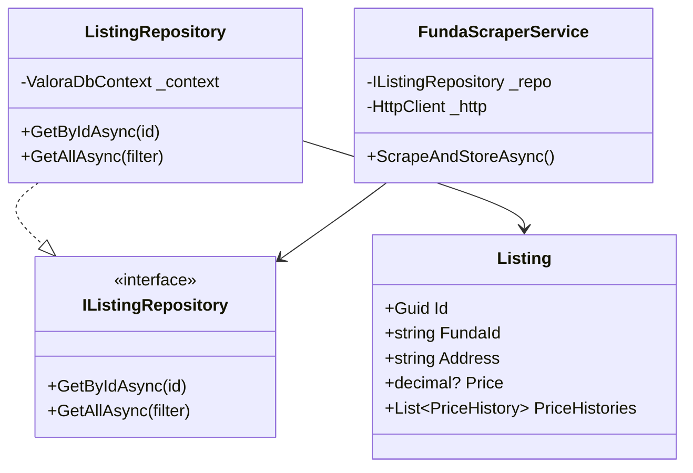
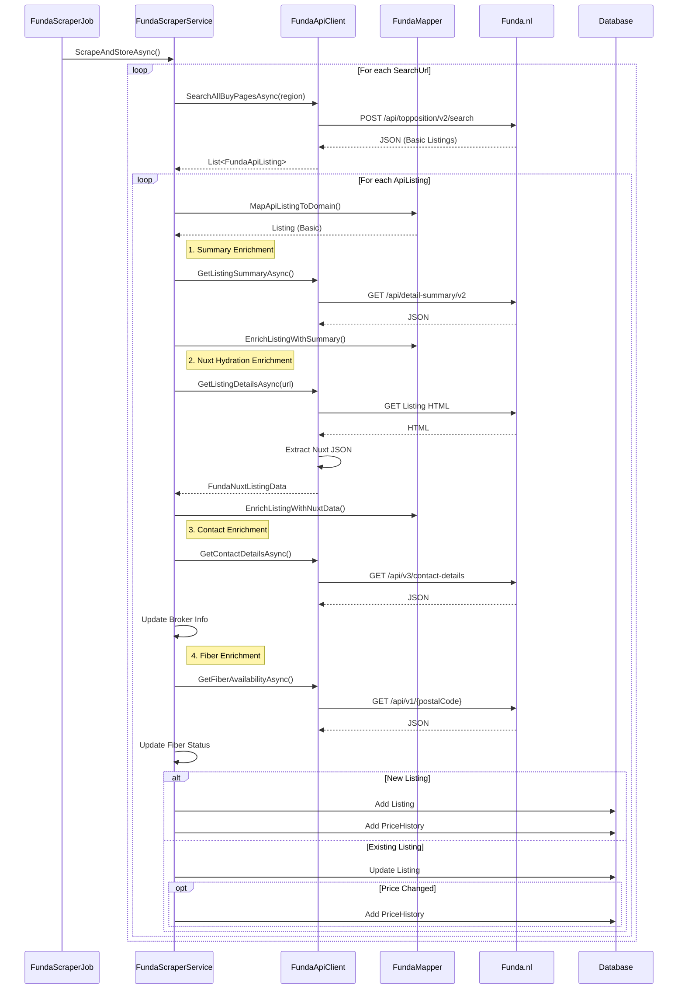

# Valora Developer Guide

This guide explains the technical architecture and implementation details of Valora.

## 🏗️ Architecture Overview

Valora follows a **Clean Architecture** approach. This ensures separation of concerns, testability, and independence from external frameworks.

### Why Clean Architecture?

1.  **Independence of Frameworks**: The architecture doesn't depend on the existence of some library of feature laden software. This allows you to use such frameworks as tools rather than having to cram your system into their limited constraints.
2.  **Testability**: The business rules can be tested without the UI, Database, Web Server, or any other external element.
3.  **Independence of UI**: The UI can change easily, without changing the rest of the system. A Web UI could be replaced with a console UI, for example, without changing the business rules.
4.  **Independence of Database**: You can swap out PostgreSQL for SQL Server or Mongo, for example. Your business rules are not bound to the database.

### Layers

1.  **Valora.Domain**
    *   **Responsibility**: Defines the core business entities and logic.
    *   **Dependencies**: None.
    *   **Key Classes**: `Listing`, `PriceHistory`, `ApplicationUser`.

2.  **Valora.Application**
    *   **Responsibility**: Defines application use cases, interfaces, and DTOs.
    *   **Dependencies**: `Valora.Domain`.
    *   **Key Interfaces**: `IListingRepository`, `IFundaScraperService`, `IAuthService`.

3.  **Valora.Infrastructure**
    *   **Responsibility**: Implements interfaces defined in the Application layer. interacting with external systems (Database, Funda.nl, Hangfire).
    *   **Dependencies**: `Valora.Application`, `Valora.Domain`.
    *   **Key Components**: `ValoraDbContext` (EF Core), `FundaScraperService`, `TokenService`.

4.  **Valora.Api**
    *   **Responsibility**: The entry point of the application. Handles HTTP requests, dependency injection, and configuration.
    *   **Dependencies**: `Valora.Application`, `Valora.Infrastructure`.
    *   **Key Components**: `Program.cs` (Minimal APIs), `AuthEndpoints`.

### Class Diagram



## 🔄 Onboarding: Data Flow

Understanding how a request travels through the system is crucial for new developers.

### Request Lifecycle: `GET /api/listings`

1.  **API Layer (`Program.cs`)**
    *   The Minimal API endpoint receives the request.
    *   `[AsParameters] ListingFilterDto filter` is bound from query parameters.
    *   `IListingRepository` is injected via DI.

2.  **Infrastructure Layer (`ListingRepository`)**
    *   `GetAllAsync` is called with the filter.
    *   The repository constructs an EF Core query based on the filter (e.g., filtering by city, price range).
    *   The query is executed against the PostgreSQL database.
    *   Results are mapped to a `PaginatedList<Listing>`.

3.  **Response**
    *   The API layer wraps the result in an anonymous object (Items, TotalCount, etc.).
    *   Returns `200 OK` with JSON.

### Scraping Workflow

This process runs via Hangfire or manual trigger. It involves a 4-step enrichment strategy to gather data that is not available on the basic search results page.



## 📚 API Documentation

The backend exposes a REST API via Minimal APIs in `Valora.Api`.

### Authentication

*   **Register**
    *   `POST /api/auth/register`
    *   Body: `{ "email": "user@example.com", "password": "Password123!" }`
    *   Response: `200 OK`

*   **Login**
    *   `POST /api/auth/login`
    *   Body: `{ "email": "user@example.com", "password": "Password123!" }`
    *   Response: `{ "accessToken": "...", "refreshToken": "...", "expiresIn": 3600 }`

*   **Refresh Token**
    *   `POST /api/auth/refresh`
    *   Body: `{ "refreshToken": "..." }`
    *   Response: `{ "accessToken": "...", "refreshToken": "..." }`

### Listings

*   `GET /api/listings`
    *   Headers: `Authorization: Bearer <token>`
    *   Query Params: `pageIndex`, `pageSize`, `minPrice`, `maxPrice`, `city`
    *   Response: Paged list of listings.

*   `GET /api/listings/{id}`
    *   Headers: `Authorization: Bearer <token>`
    *   Response: Detailed listing DTO.

### Scraper

*   `POST /api/scraper/trigger`
    *   Headers: `Authorization: Bearer <token>`
    *   Triggers the `FundaScraperJob` immediately via Hangfire.

## ⚙️ Configuration

Configuration is managed entirely via **Environment Variables**. There is no `appsettings.json`.

| Variable | Description | Example |
|----------|-------------|---------|
| `DATABASE_URL` | PostgreSQL connection string | `Host=localhost;Database=valora;Username=postgres;Password=postgres` |
| `JWT_SECRET` | Secret for signing tokens | `SuperSecretKeyForDevelopmentOnly123!` |
| `SCRAPER_SEARCH_URLS` | Semicolon-separated Funda URLs | `https://www.funda.nl/koop/amsterdam/` |
| `HANGFIRE_ENABLED` | Enable background jobs | `true` |

## 🧪 Testing

### Backend

Uses xUnit and Testcontainers for integration testing.

```bash
cd backend
dotnet test
```

**Note**: Docker must be running for integration tests to pass.

### Manual Verification

To manually verify the scraper:
1.  Ensure Backend and Database are running.
2.  Login via Postman or the Frontend to get a token.
3.  Call `POST /api/scraper/trigger` with the token.
4.  Check the logs or `http://localhost:5000/hangfire` to see the job processing.
