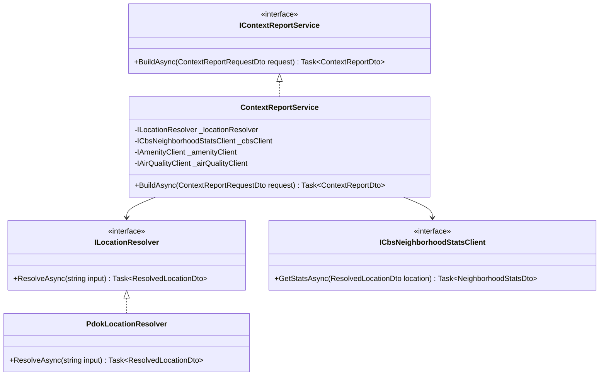

# Valora Developer Guide

## Overview

Valora is an enrichment backend + Flutter client. It does not scrape listing sites. It builds context reports from public APIs at request time.

## Clean Architecture Layers

1. `Valora.Domain`
- Pure entities and domain concerns.
- No dependencies on external packages/layers.

2. `Valora.Application`
- Interfaces and DTO contracts for use cases.
- Key contracts include `IContextReportService`, `ILocationResolver`, and source client interfaces.

3. `Valora.Infrastructure`
- Implements application interfaces.
- Handles EF Core persistence and HTTP connectors for external/public data sources.

4. `Valora.Api`
- Minimal APIs for auth, health, and context report generation.
- No business logic in endpoints.

## Enrichment Class Diagram



## Key Endpoint: Context Report

### `POST /api/context/report`

Generates a full context report for a given location. Requires Authentication (Bearer Token).

**Request Body**:

```json
{
  "input": "Damrak 1, Amsterdam",
  "radiusMeters": 1000
}
```

- `input`: Plain address string or a listing URL (e.g., funda.nl).
- `radiusMeters`: Integer between 200 and 5000 (clamped by server).

**Response Body**:

```json
{
  "location": {
    "query": "Damrak 1, Amsterdam",
    "displayAddress": "Damrak 1, 1012LG Amsterdam",
    "latitude": 52.375,
    "longitude": 4.896,
    "neighborhoodName": "Burgwallen-Oude Zijde"
  },
  "compositeScore": 8.5,
  "socialMetrics": [
    {
      "key": "population_density",
      "label": "Population Density",
      "value": 15000,
      "unit": "people/km2",
      "score": 50,
      "source": "CBS StatLine 83765NED"
    }
  ],
  "amenityMetrics": [],
  "environmentMetrics": [],
  "sources": [
    {
      "source": "PDOK Locatieserver",
      "url": "https://api.pdok.nl",
      "license": "Publiek",
      "retrievedAtUtc": "2023-10-27T10:00:00Z"
    }
  ],
  "warnings": []
}
```

## Scoring Logic

The `ContextReportService` calculates scores based on raw data. Scores range from 0 to 100.

### Composite Score
The final score is a weighted average of three categories:

| Category | Weight |
|---|---|
| **Social** | 45% |
| **Amenity** | 35% |
| **Environment** | 20% |

### Individual Metric Scoring

*   **Population Density**:
    *   <= 500: 65 (Too sparse)
    *   <= 1500: 85 (Good)
    *   <= 3500: 100 (Optimal urban)
    *   <= 7000: 70 (Dense)
    *   > 7000: 50 (Very dense)

*   **Amenity Proximity** (Distance to nearest amenity):
    *   <= 250m: 100
    *   <= 500m: 85
    *   ... decays to 25 at > 2km.

*   **Air Quality (PM2.5)**:
    *   <= 5 µg/m3: 100 (Excellent)
    *   <= 10: 85
    *   ... decays to 10 at > 35 µg/m3.

## Configuration

Core environment variables:

| Variable | Description |
|---|---|
| `DATABASE_URL` | PostgreSQL connection string |
| `JWT_SECRET` | JWT signing secret |
| `JWT_ISSUER` | JWT issuer |
| `JWT_AUDIENCE` | JWT audience |
| `API_URL` | Flutter app backend URL (`apps/flutter_app/.env`) |
| `CONTEXT_PDOK_BASE_URL` | Optional PDOK base URL override |
| `CONTEXT_CBS_BASE_URL` | Optional CBS base URL override |
| `CONTEXT_OVERPASS_BASE_URL` | Optional Overpass base URL override |
| `CONTEXT_LUCHTMEETNET_BASE_URL` | Optional Luchtmeetnet base URL override |
| `CONTEXT_*_CACHE_MINUTES` | Per-source cache TTL tuning |

API key expectations:

- No key required by default for PDOK, CBS StatLine, Overpass, and Luchtmeetnet base connectors.
- `OPENROUTER_API_KEY` is required only for AI chat endpoints.
- Optional future connectors may require keys (for example ORS/KNMI/DUO); keep those values in `.env` and never commit secrets.

## Testing

### Backend

```bash
cd backend
dotnet test
```

Integration tests use EF Core InMemory in this environment.

### Frontend

```bash
cd apps/flutter_app
flutter analyze
flutter test
```

## Coding Notes

- Keep source connectors isolated behind application interfaces.
- Favor graceful degradation: missing source data should return warnings, not 500.
- Keep scoring explainable with clear metric/source mapping.
