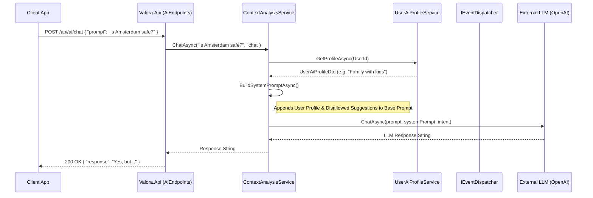

# Onboarding Guide: AI Chat Data Flow

This guide walks through the data flow for the Valora AI Chat feature, tracking a request from the user's prompt down to the external LLM provider.

## High-Level Sequence Diagram

The following Mermaid diagram maps out the complete flow for `POST /api/ai/chat`.

## Step-by-Step Breakdown

### 1. The Request Arrives (`Valora.Api`)
* **Location:** `Valora.Api/Endpoints/AiEndpoints.cs`
* The client sends a `POST` request to `/api/ai/chat` with an `AiChatRequest` payload containing the user's text prompt and an optional intent (e.g., "chat").
* The `AiEndpoints` routing maps the request, passes it through the validation filter, and delegates execution to `IContextAnalysisService`.

### 2. Service Logic & Profile Resolution (`Valora.Application`)
* **Location:** `Valora.Application/Services/ContextAnalysisService.cs`
* The `ContextAnalysisService.ChatAsync` method acts as the central orchestrator for AI logic.
* To provide personalized responses, the service fetches the user's AI preferences (e.g., household type, disallowed suggestions) via the `IUserAiProfileService`.

### 3. System Prompt Construction
* The `BuildSystemPromptAsync` method injects the user's saved preferences directly into the system instructions given to the LLM.
* It sanitizes user profile inputs to prevent prompt-injection attacks.
* If the user specifies "No luxury apartments," this constraint is appended to the prompt, ensuring the AI adheres to the user's specific context.

### 4. External LLM Invocation
* The combined prompt (System Instructions + User Question) is passed to the `IAiService`.
* The `IAiService` implementation handles routing the request to the configured backend (e.g., OpenAI GPT-4o) and managing retries and timeouts.
* Upon success, the LLM response string is returned to the client wrapped in an API response object.

## Security & Privacy Considerations

* **Prompt Injection Defense:** Profile strings like `HouseholdProfile` and `Preferences` are passed through `PromptSanitizer.Sanitize()` before being appended to the system prompt.
* **Statelessness:** The AI service does not store conversation history server-side. The client must pass the relevant conversational context if a multi-turn chat is required.
