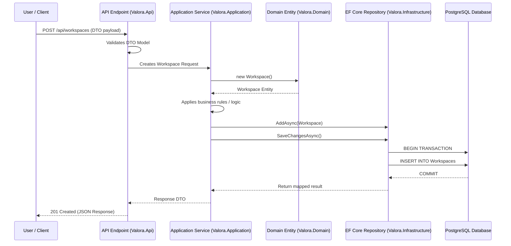

# Onboarding Guide: Data Flow from API Request to Database Persistence

This document explains the step-by-step data flow from the moment an HTTP request is made to the Valora API until the data is safely persisted to the PostgreSQL database.

## Architecture & Data Flow Overview

Valora strictly adheres to Clean Architecture. Any request modifying data will pass through the API layer, down to Application logic, interact with Domain models, and be saved by the Infrastructure repository.

## Step 1: API Endpoint Routing

When a request arrives at the API (e.g., `POST /api/workspaces`), ASP.NET Core Minimal APIs handles the routing. The API layer (`Valora.Api`) defines routes and maps the JSON body to a Data Transfer Object (DTO).

If validation filters pass, the request data is forwarded to the corresponding `Application` layer service. The API layer contains NO business logic or database dependencies.

## Step 2: Application Layer Logic

Inside `Valora.Application`, the incoming DTO is handled by a Service. The service is responsible for validating domain invariants. If it requires updating existing records, it asks the repository for the domain entity first.

## Step 3: Domain Entities and Rules

The `Domain` layer (`Valora.Domain`) contains the actual models. If a new entity needs to be created, the service instantiates a new entity object. Domain logic validation is enforced right here within the entities themselves or by domain services, independently of how the data is saved.

## Step 4: Infrastructure and Persistence

Once the Application Layer modifies or creates the entity, it calls a repository method (from `Valora.Infrastructure`). The repository tracks changes using Entity Framework Core's `DbContext`. When `SaveChangesAsync` is invoked, EF Core translates these changes into SQL queries (e.g., `INSERT`, `UPDATE`), starts a transaction, and writes them to the underlying PostgreSQL database.

## Step 5: Returning the Response

The updated entity is then mapped back into a DTO and returned to the API layer, which sets the HTTP status code (e.g., `201 Created` or `200 OK`) and sends the response back to the client.