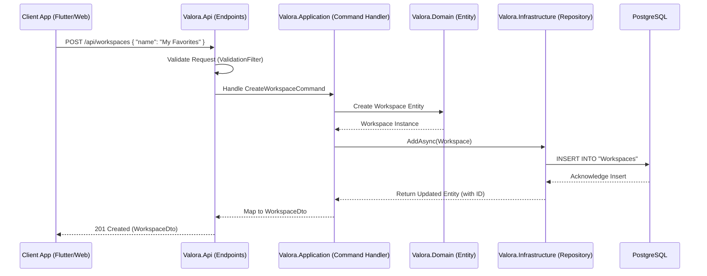

# Onboarding Guide: Data Flow from API Request to Database Persistence

This guide traces the exact path a write request takes in Valora, starting from an external client (e.g., the Flutter App or Admin Dashboard) hitting an API endpoint, moving through our Clean Architecture layers, and finally being persisted in the PostgreSQL database via Entity Framework Core.

To understand this flow, we will use the creation of a **Workspace** as our example. A Workspace allows users to save and group context reports.

## High-Level Sequence Diagram

The following Mermaid diagram maps out the complete "Write" lifecycle for `POST /api/workspaces`.

## Step-by-Step Breakdown

### 1. The Request Arrives (API Layer)
* **Location:** `Valora.Api/Endpoints/...`
* The request is received by a Minimal API endpoint. Before the core logic is hit, it passes through the `ValidationFilter`.
* The `ValidationFilter` enforces DataAnnotations (like string lengths) and checks for XSS strings. If validation fails, it returns a `400 Bad Request` with standard RFC 7807 `ProblemDetails`.

### 2. Orchestration (Application Layer)
* **Location:** `Valora.Application/UseCases/...`
* The API endpoint extracts the DTO (Data Transfer Object) and maps it to a command (e.g., `CreateWorkspaceCommand`).
* The application layer handler is invoked. This layer is responsible for the "Use Case". It does not implement business rules directly but orchestrates the domain models and repositories.

### 3. Business Logic (Domain Layer)
* **Location:** `Valora.Domain/Entities/...`
* The Application layer instantiates a Domain Entity. In Valora, entities are rich objects. We use private setters and constructors to ensure an entity can only be created in a valid state.
* If a business rule is violated (e.g., trying to create a workspace with an invalid name), the domain model throws a `DomainException`.

### 4. Database Persistence (Infrastructure Layer)
* **Location:** `Valora.Infrastructure/Persistence/Repositories/...`
* The Application layer passes the new entity to the appropriate Repository interface (e.g., `IWorkspaceRepository`).
* The Infrastructure layer's implementation of this repository takes the entity, attaches it to the `ValoraDbContext`, and calls `SaveChangesAsync()`.
* Entity Framework Core translates the state changes into an SQL `INSERT` statement and executes it against PostgreSQL.

### 5. Returning the Response
* Once `SaveChangesAsync` is complete, the repository returns control to the Application layer.
* The entity now has its database-generated ID (and audit timestamps like `CreatedAt`).
* The Application layer maps the Domain Entity back into a DTO. Remember: **Never return Domain Entities directly from the API.**
* The API layer serializes the DTO to JSON and sends a `201 Created` response to the client.

## Summary

This architecture guarantees that the database schema is decoupled from the API contract. DTOs are for external communication, Entities are for internal business logic, and EF Core Configurations handle the mapping to database tables.