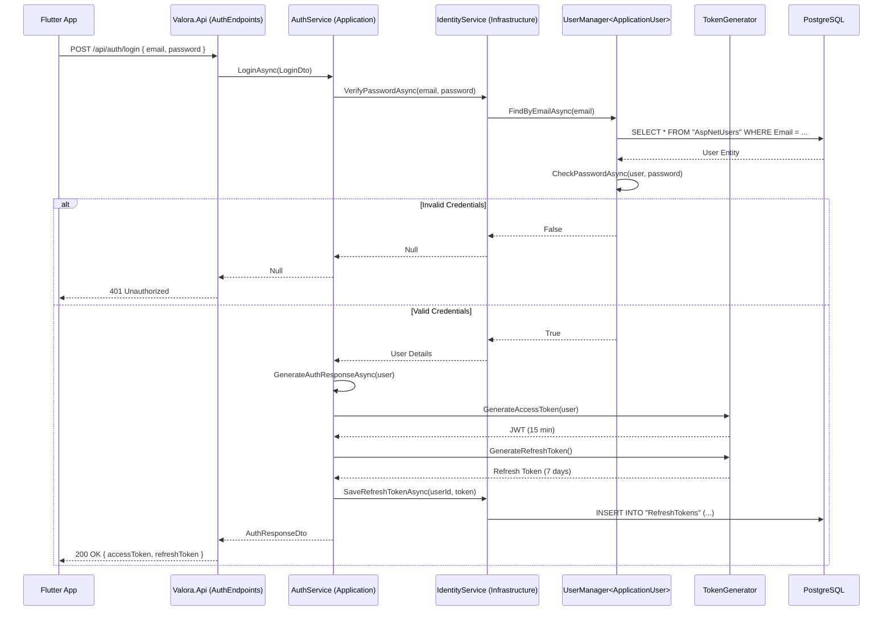
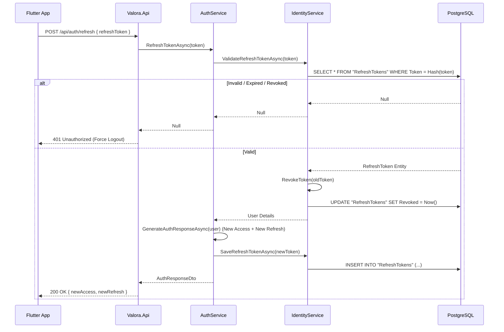

# Data Flow: Authentication (Login & Refresh)

This guide explains how Valora handles user authentication, specifically the **Login** and **Token Refresh** flows.

## High-Level Sequence: Login

The following diagram illustrates the lifecycle of a `POST /api/auth/login` request.

## Detailed Steps

### 1. Request Handling (`Valora.Api`)
- The endpoint `POST /api/auth/login` receives the credentials.
- **Rate Limiting:** This endpoint is strictly rate-limited ("strict" policy) to prevent brute-force attacks.
- It delegates to `IAuthService.LoginAsync`.

### 2. Verification (`Valora.Infrastructure`)
- `IdentityService` retrieves the user by email.
- It uses ASP.NET Core Identity's password hasher to verify the provided password against the stored hash.

### 3. Token Generation (`Valora.Application`)
- Upon successful verification, the system generates two tokens:
  - **Access Token (JWT):** Short-lived (e.g., 15-60 minutes). Contains claims (UserId, Email, Roles) and is signed with the `JWT_SECRET`. Used for authorizing API requests.
  - **Refresh Token:** Long-lived (e.g., 7 days). A random secure string stored in the database. Used to obtain a new Access Token when the old one expires.

### 4. Persistence
- The **Refresh Token** is hashed (SHA-256) and stored in the `RefreshTokens` table linked to the user.
- This allows the server to revoke sessions by deleting the refresh token from the database.

---

## High-Level Sequence: Token Refresh

When the Access Token expires (401), the client uses the Refresh Token to get a new pair.

### Refresh Token Rotation
- **Security Feature:** We use **Refresh Token Rotation**. When a refresh token is used, it is immediately revoked (or deleted), and a *new* refresh token is issued.
- **Why?** If a refresh token is stolen, the thief can only use it once. If the legitimate user then tries to use the same (now old) refresh token, the server detects the reuse and can revoke *all* tokens for that user (Reuse Detection).
