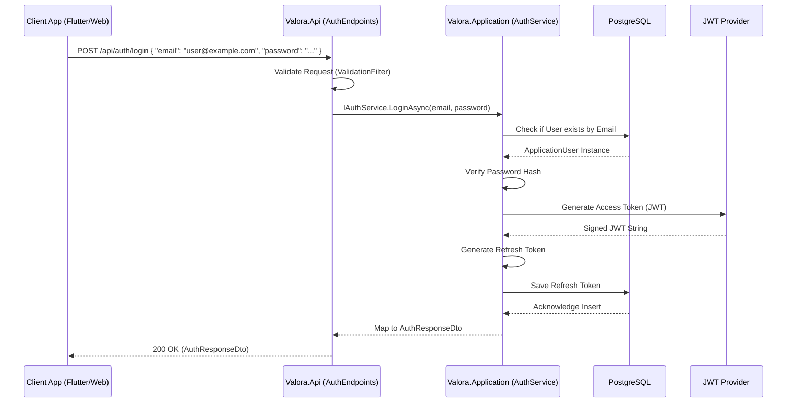

# Onboarding Guide: Authentication Data Flow

This guide walks through the data flow for user authentication from the API request down to database persistence, explaining how Valora issues and validates JWT tokens.

## High-Level Sequence Diagram

The following Mermaid diagram maps out the complete "Login" lifecycle for `POST /api/auth/login`.

```mermaid
sequenceDiagram
    participant Client as Client App (Flutter/Web)
    participant API as Valora.Api (AuthEndpoints)
    participant Service as Valora.Application (AuthService)
    participant DB as PostgreSQL
    participant JWT as JWT Provider

    Client->>API: POST /api/auth/login { "email": "user@example.com", "password": "..." }

    %% API Layer Validation
    API->>API: Validate Request (ValidationFilter)

    %% Delegate to Application Layer
    API->>Service: IAuthService.LoginAsync(email, password)

    %% Persistence Call
    Service->>DB: Check if User exists by Email
    DB-->>Service: ApplicationUser Instance

    %% Business Logic
    Service->>Service: Verify Password Hash

    %% Token Generation
    Service->>JWT: Generate Access Token (JWT)
    JWT-->>Service: Signed JWT String

    Service->>Service: Generate Refresh Token
    Service->>DB: Save Refresh Token
    DB-->>Service: Acknowledge Insert

    %% Completion
    Service-->>API: Map to AuthResponseDto
    API-->>Client: 200 OK (AuthResponseDto)
```

## Step-by-Step Breakdown

### 1. The Request Arrives (API Layer)
* **Location:** `Valora.Api/Endpoints/AuthEndpoints.cs`
* The request is received by a Minimal API endpoint. Before the core logic is hit, it passes through the `ValidationFilter`.
* The `ValidationFilter` enforces DataAnnotations (e.g., valid email format, minimum password length). If validation fails, it returns a `400 Bad Request`.
* The endpoint extracts the DTO and invokes `IAuthService.LoginAsync`.

### 2. Service Logic (Application Layer)
* **Location:** `Valora.Application/Services/AuthService.cs`
* The application layer service checks if the user exists in the database.
* If the user exists, it verifies the provided password against the hashed password stored in the database.

### 3. Database Persistence (Infrastructure Layer)
* **Location:** `Valora.Infrastructure/Persistence/ValoraDbContext.cs`
* The Application layer queries the `ApplicationUser` entity from the PostgreSQL database using Entity Framework Core.
* When generating a new Refresh Token, the service tracks the new token entity and calls `SaveChangesAsync()` to persist it.

### 4. Returning the Response
* Once the tokens are generated and the refresh token is saved, the service returns control to the API.
* The API layer returns a `200 OK` response with the Access Token and Refresh Token to the client.

## Summary

This architecture guarantees that the database schema is decoupled from the API contract, while keeping the security logic cleanly separated into the Application layer.
