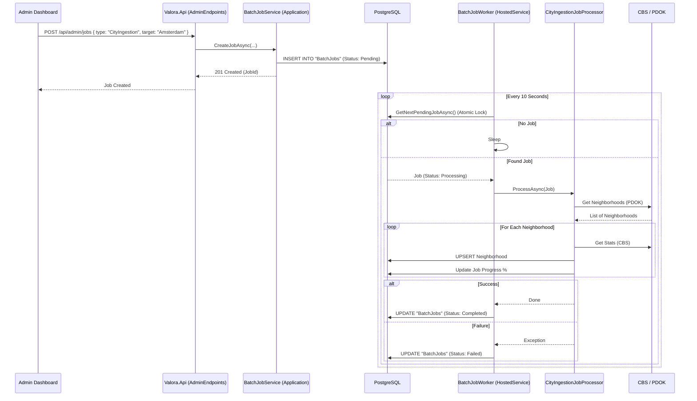

# Data Flow: Batch Job Processing

This guide explains how Valora handles long-running background tasks, such as **City Ingestion** (fetching all neighborhoods for a city from CBS).

## High-Level Sequence

The following diagram illustrates the lifecycle of a `POST /api/admin/jobs` request.

## Detailed Steps

### 1. Job Creation (`Valora.Api`)
- An Admin user submits a job request.
- The `BatchJobService` validates the request and creates a record in the `BatchJobs` table with status `Pending`.
- The API returns immediately. It does *not* wait for the job to finish.

### 2. The Worker Loop (`BatchJobWorker`)
- This is a `BackgroundService` running in the same process as the API (but on a separate thread).
- It polls the database periodically (e.g., every 10 seconds).
- It uses `IBatchJobRepository.GetNextPendingJobAsync` to fetch the next available job.
- **Concurrency Control:** The repository uses a database lock (or `UPDATE ... RETURNING ...` pattern) to ensure that if multiple API instances are running, a job is only picked up by *one* worker.

### 3. Execution (`CityIngestionJobProcessor`)
- The worker delegates execution to the specific processor for the job type (e.g., `CityIngestionJobProcessor`).
- **Optimization:** The processor fetches all existing neighborhoods for the city first to avoid N+1 queries ("Get By City").
- **Batching:** It processes neighborhoods in batches (e.g., 10 at a time) and saves changes to the `Neighborhoods` table.
- **Progress:** It updates the `Progress` percentage and `ExecutionLog` on the `BatchJob` entity periodically.

### 4. Completion
- Once finished, the worker updates the final status to `Completed` or `Failed`.
- Admins can view the `ExecutionLog` to see details or errors.

## Key Concepts

### Isolation
Jobs run in their own Dependency Injection scope. This means they have their own `DbContext` instance, separate from any incoming HTTP requests.

### Resilience
- If the server crashes while a job is `Processing`, the job remains stuck in `Processing`.
- **Note:** The `BatchJobService.RetryJobAsync` method allows admins to manually reset these stuck jobs to `Pending`.
