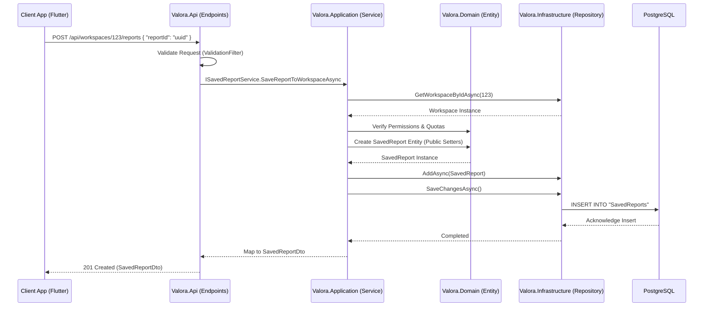

# Onboarding Guide: Data Flow from API Request to Database Persistence

This guide traces the exact path a write request takes in Valora, starting from an external client (e.g., the Flutter App or Admin Dashboard) hitting an API endpoint, moving through our Clean Architecture layers, and finally being persisted in the PostgreSQL database via Entity Framework Core.

To understand this flow, we will use the creation of a **Saved Context Report** within a **Workspace** as our example.

## High-Level Sequence Diagram

The following Mermaid diagram maps out the complete "Write" lifecycle for `POST /api/workspaces/{id}/reports`.

## Step-by-Step Breakdown

### 1. The Request Arrives (API Layer)
* **Location:** `Valora.Api/Endpoints/WorkspaceEndpoints.cs`
* The request is received by a Minimal API endpoint (`MapPost("/{id}/reports")`). Before the core logic is hit, it passes through the `ValidationFilter`.
* The `ValidationFilter` enforces DataAnnotations and verifies the User's JWT token.
* The endpoint extracts the DTO and invokes `ISavedReportService.SaveReportToWorkspaceAsync`.

### 2. Service Logic (Application Layer)
* **Location:** `Valora.Application/Services/SavedReportService.cs`
* The application layer service performs necessary business checks (e.g., verifying the user has write access to the workspace, checking if the report limit has been reached).
* The service retrieves the `Workspace` entity and instantiates a new `SavedReport` entity.

### 3. Domain Entity (Domain Layer)
* **Location:** `Valora.Domain/Entities/SavedReport.cs` & `Valora.Domain/Common/BaseEntity.cs`
* The `SavedReport` entity is initialized using its properties.
* The base properties like `Id` (GUID) and `CreatedAt` (UTC Now) are automatically assigned default values within the `BaseEntity` constructor.

### 4. Database Persistence (Infrastructure Layer)
* **Location:** `Valora.Infrastructure/Persistence/Repositories/SavedReportRepository.cs`
* The Application layer calls `_repository.AddAsync(report)` to track the entity, and then explicitly calls `_repository.SaveChangesAsync()`.
* Entity Framework Core translates the tracked entity state into an SQL `INSERT` statement and executes it against PostgreSQL.

### 5. Returning the Response
* Once `SaveChangesAsync` is complete, the repository returns control to the Application service.
* The Application layer maps the saved Entity into a `SavedReportDto` to avoid leaking domain objects.
* The API layer returns a `201 Created` response to the client.

## Summary

This architecture guarantees that the database schema is decoupled from the API contract. DTOs are for external communication, Entities are for internal business logic, and EF Core Configurations handle the mapping to database tables.