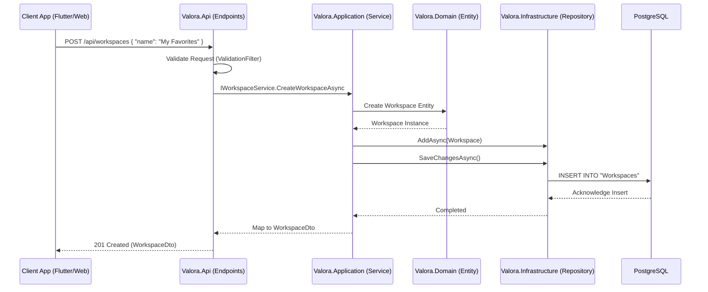

# Onboarding Guide: Data Flow from API Request to Database Persistence

Welcome to Valora! This guide visually walks through the exact path a write request takes in Valora, starting from an external client (e.g., the Flutter App or Admin Dashboard) hitting an API endpoint, moving through our Clean Architecture layers, and finally being persisted in the PostgreSQL database.

## Architecture Data Flow Diagram

The following Mermaid diagram maps out the complete "Write" lifecycle using `POST /api/workspaces` as an example.

## Layer Breakdown

1. **API Layer (`Valora.Api`)**: Handles HTTP requests, authentication, and simple validation. It delegates all business logic to the Application layer.
2. **Application Layer (`Valora.Application`)**: Contains Use Cases/Services. Orchestrates the flow, enforces business rules, and transforms Entities into DTOs.
3. **Domain Layer (`Valora.Domain`)**: Contains the core Entities and rich domain models. Independent of all other layers.
4. **Infrastructure Layer (`Valora.Infrastructure`)**: Handles database context (`DbContext`), EF Core interactions, and external API requests.