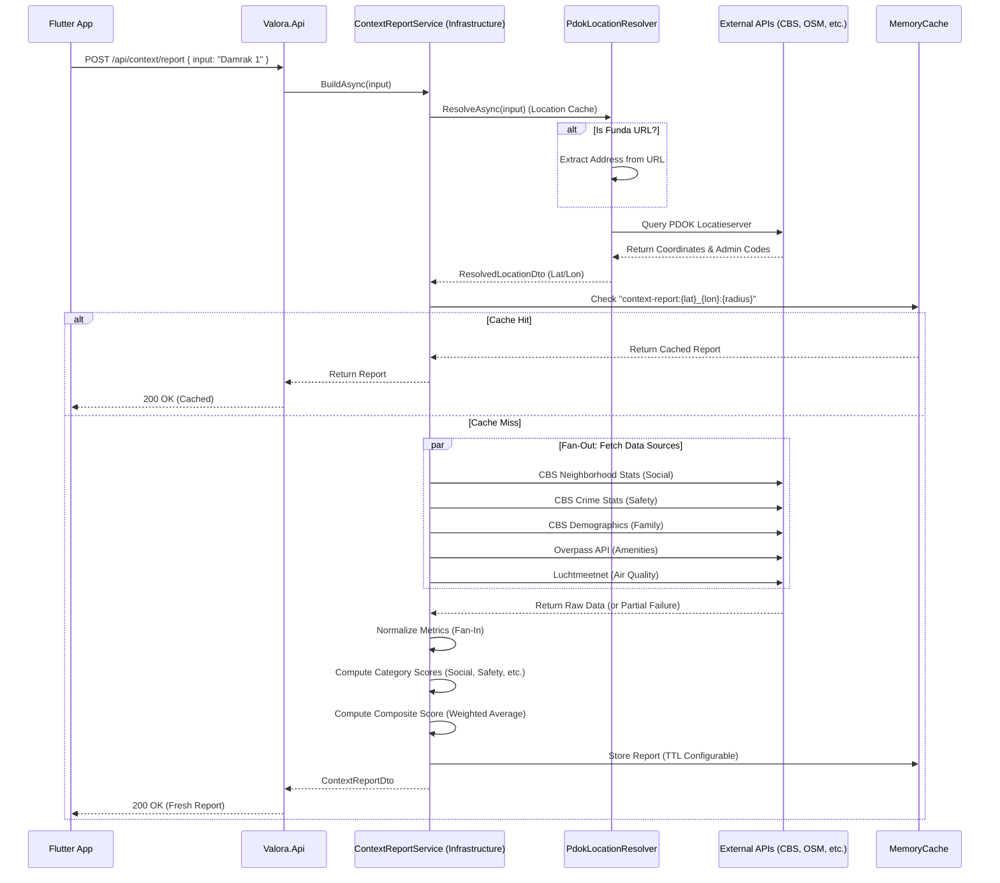

# Data Flow: From Request to Report

This guide explains how Valora processes a user request to generate a context report. It walks through the flow from the API endpoint down to the external data sources.

## High-Level Sequence

The following diagram illustrates the lifecycle of a `POST /api/context/report` request.

## Detailed Steps

### 1. Request Handling (`Valora.Api`)
- The endpoint `POST /api/context/report` receives the request.
- It validates that the `input` string is not empty.
- It delegates the work to the `IContextReportService` interface (implemented in `Valora.Infrastructure`).

### 2. Location Resolution (`PdokLocationResolver`)
- **Input Normalization:** If the input is a Funda URL, the resolver extracts the address slug. Otherwise, it uses the raw address string.
- **PDOK Query:** It calls the PDOK Locatieserver `free` endpoint to find the best matching address.
- **Result:** It returns a `ResolvedLocationDto` containing:
  - WGS84 Coordinates (Latitude/Longitude)
  - RD Coordinates (Rijksdriehoek X/Y)
  - Administrative codes (Municipality, Neighborhood, District codes)

### 3. Parallel Data Fetching (`ContextReportService`)
- The service uses a **Fan-Out** pattern to query multiple sources simultaneously:
  - **CBS:** Uses neighborhood codes to fetch population, income, and housing stats.
  - **CBS Crime:** Uses neighborhood codes to fetch theft, burglary, and vandalism rates.
  - **Overpass (OSM):** Uses coordinates and radius to count amenities (schools, supermarkets, etc.).
  - **Luchtmeetnet:** Uses coordinates to find the nearest air quality station.
- **Resilience:** Each call is wrapped in a `TryGetSourceAsync` block. If a source fails (e.g., Luchtmeetnet is down), the exception is logged, and the report generation continues with partial data.

### 4. Scoring & Aggregation
- **Normalization:** Raw values (e.g., "45 crimes per 1000") are converted into standardized 0-100 scores using heuristic curves defined in `ContextReportService`.
- **Category Scores:** Individual metrics are averaged to produce category scores (Social, Safety, Amenities, Environment).
- **Composite Score:** Category scores are weighted (Safety 25%, Amenities 30%, etc.) to produce a final 0-100 "Valora Score".

### 5. Caching & Response
- The final `ContextReportDto` is cached in memory to speed up identical subsequent requests.
- The report is returned to the client, including a list of `Warnings` if any data source failed.
