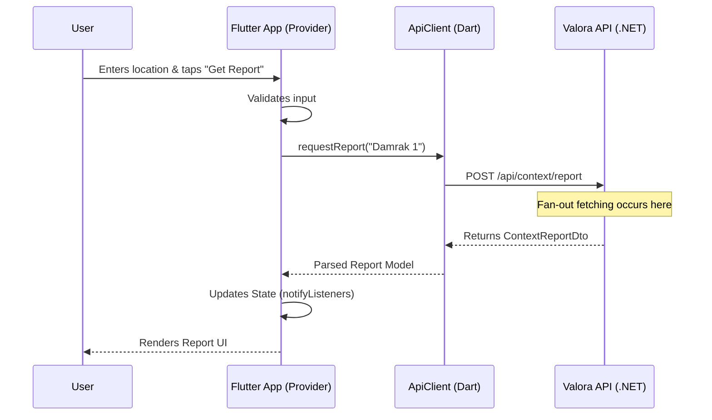
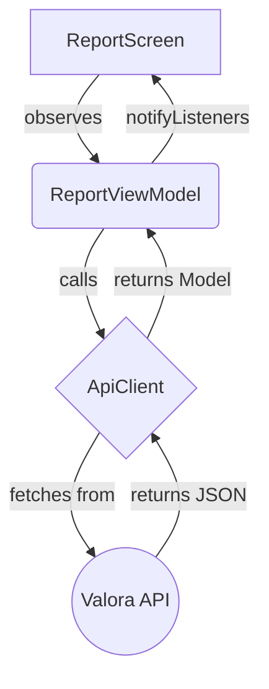

# Onboarding Guide: Frontend Architecture

This guide explains the frontend architecture of the Valora Flutter application and the Admin Dashboard, including how data flows from the UI to the backend API.

## High-Level Sequence Diagram

The following Mermaid diagram maps out the complete flow of data from the Flutter app to the API and back.

## Flutter State Management

We use `Provider` and `ChangeNotifier` to manage state in the Flutter app.

*   **View Models**: Controllers that fetch data from the `ApiClient` and hold the state (loading, error, success).
*   **Widgets**: UI components that observe the state and rebuild when `notifyListeners` is called.

### Example: The Report Screen

## Admin Dashboard

The Admin Dashboard is built with React and Vite. It uses standard React hooks for state and Axios for making API requests to the Valora backend.

## Best Practices

*   **UI/UX Polish**: Always ensure micro-interactions, hover/tap feedback, and smooth transitions are present.
*   **Performance**: Use `Selector` instead of `Consumer` in Flutter to avoid unnecessary widget rebuilds.
*   **Error Handling**: Always display a user-friendly error state when an API call fails.
