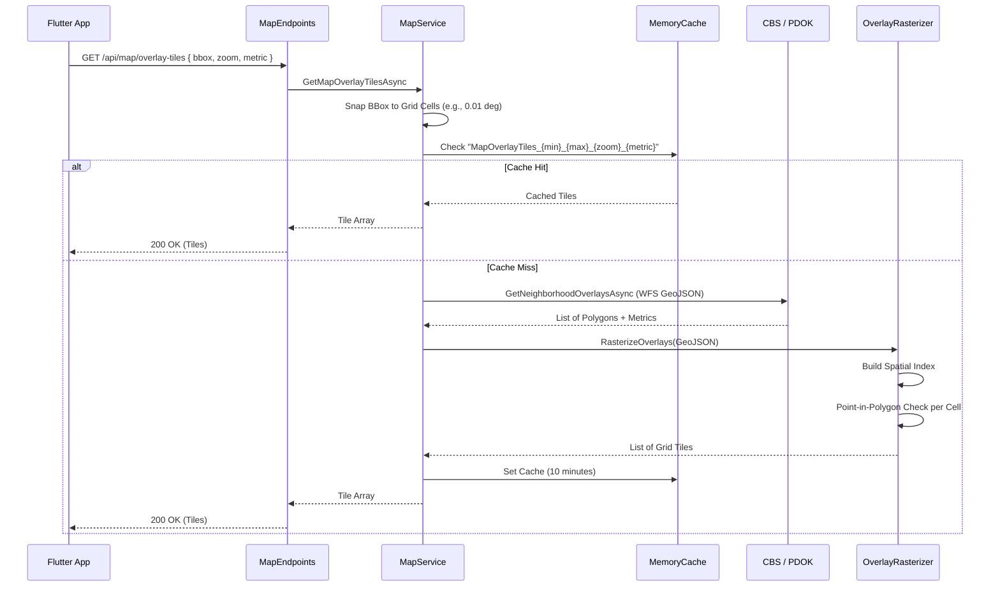
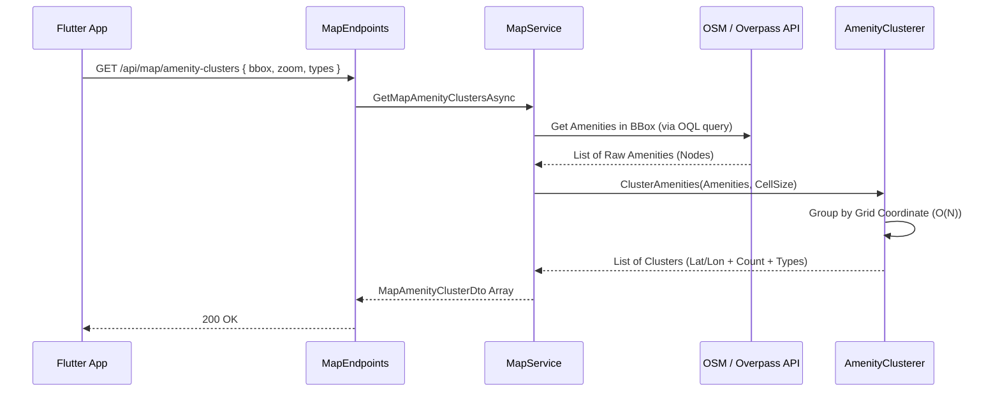

# Data Flow: Interactive Map Overlays

This guide details the flow of data when a user interacts with the Map tab in the Valora App (e.g., viewing population density heatmaps or amenity clusters).

## High-Level Sequence: Map Overlay Tiles

When a user selects a map metric (like `PopulationDensity`), the map needs to render a colored overlay. Instead of sending raw, complex GeoJSON polygons to the Flutter client (which would cause lag), the server rasterizes the data into lightweight tiles.

### Why Rasterize Server-Side?
Rendering complex polygons (thousands of vector points) natively in a Flutter map using `PolygonLayer` severely drops frames. By creating a grid of simple, square "tiles" (points with a size) on the backend, the Flutter app only renders a few hundred low-fidelity squares via a heatmap layer, guaranteeing a smooth 60fps experience on mobile devices.

---

## High-Level Sequence: Amenity Clusters

Similar to overlays, rendering every individual tree, bench, or café from OpenStreetMap can crash the app. Amenities are requested via a bounding box and clustered before reaching the client.

### Why Server-Side Grid Clustering?
Standard distance-based clustering algorithms (like DBSCAN) have O(N^2) complexity, making them too slow for real-time requests with thousands of items.
By using a simple grid mapping approach (where coordinates are bucketed via integer division of the cell size), the algorithm processes in strict O(N) time. The tradeoff is that clusters snap to grid centers rather than true geometric centroids, but the performance gain is worth it.
