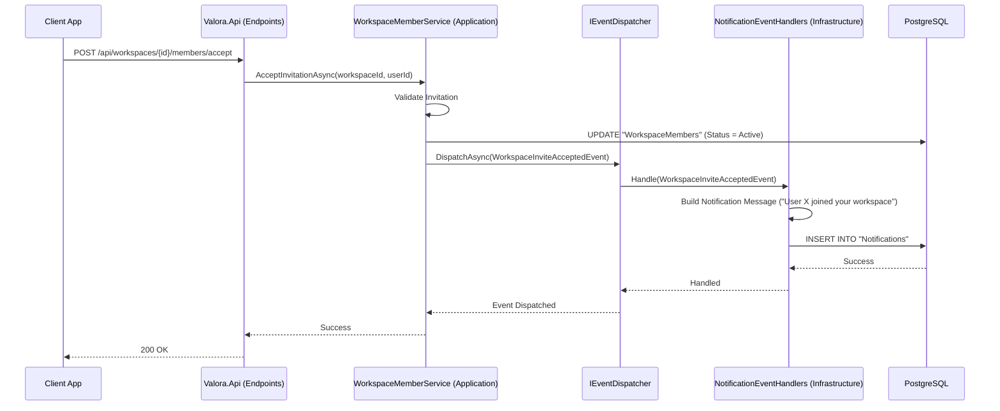

# Onboarding Guide: Notification Data Flow

This guide traces the data flow of how in-app notifications are generated and delivered within Valora, using the Domain Events pattern.

We will use the **Workspace Invitation Acceptance** scenario as our primary example. When a user accepts an invitation to join a Workspace, the system needs to notify the original inviter.

## High-Level Sequence Diagram

The following Mermaid diagram maps out the complete flow for generating a notification when `POST /api/workspaces/{id}/members/accept` is called.

## Step-by-Step Breakdown

### 1. The Triggering Action (Application Layer)
* **Location:** `Valora.Application/Services/WorkspaceMemberService.cs`
* When a user performs an action (like accepting an invite), the application service handles the core business logic (e.g., verifying the token, updating the user's role in the workspace).
* Instead of directly injecting a `NotificationService` into the `WorkspaceMemberService` (which creates tight coupling), the service creates a Domain Event: `WorkspaceInviteAcceptedEvent`.
* The service then calls `_eventDispatcher.DispatchAsync(event)`.

### 2. Event Dispatching
* **Location:** `Valora.Application/Common/Events/IEventDispatcher.cs`
* The `IEventDispatcher` acts as a mediator. It looks up any registered handlers for the specific event type being dispatched.
* This allows the system to trigger multiple side-effects (like sending an email *and* an in-app notification) without the core service needing to know about them.

### 3. Handling the Event (Infrastructure Layer)
* **Location:** `Valora.Infrastructure/Events/NotificationEventHandlers.cs`
* The `NotificationEventHandlers` class listens for `WorkspaceInviteAcceptedEvent`.
* When the event is received, the handler constructs the specific notification payload (title, message, and deep link back to the workspace).
* It then uses the `INotificationService` (or a repository) to persist the new `Notification` entity to the database.

### 4. Client Retrieval
* The next time the affected user (the inviter) opens the Valora app or polls the API, they will call `GET /api/notifications` and retrieve the newly inserted notification.

## Key Concepts

### Why Domain Events?
* **Decoupling:** Services don't need to know about every possible side-effect of their actions.
* **Maintainability:** If we want to add a push notification via Firebase later, we just add a new handler for the `WorkspaceInviteAcceptedEvent`. We don't have to touch the `WorkspaceMemberService` at all.
* **Single Responsibility:** The `WorkspaceMemberService` is only responsible for managing members, not for formatting notification strings.
