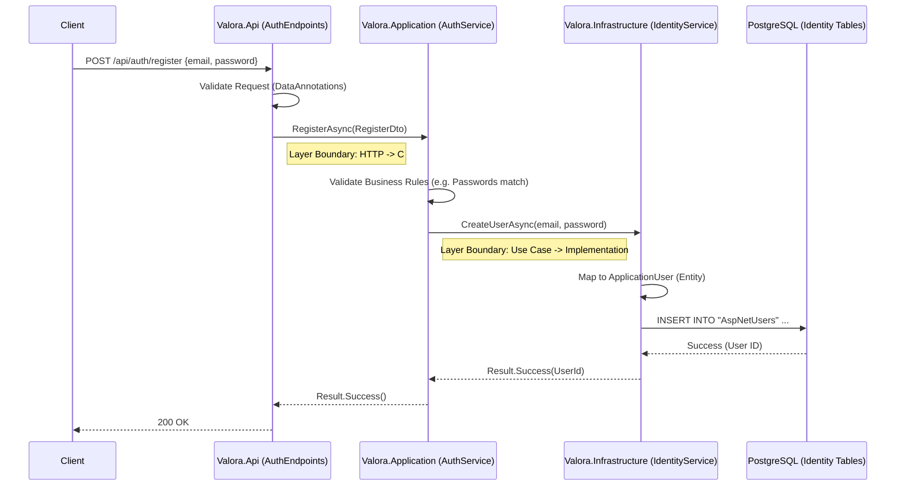

# Data Flow: From Request to Persistence

This guide explains how data flows through the Valora backend when a write operation occurs, resulting in database persistence. We use the **User Registration** flow as the primary example.

## The Clean Architecture Pipeline

Valora enforces a strict dependency rule: **Dependencies only point inwards.**
`API -> Application -> Domain <- Infrastructure`

When data needs to be saved (persisted), it travels through these layers.

## Step-by-Step Breakdown

### 1. API Layer (`Valora.Api`)
**Responsibility:** HTTP handling, Request Validation.

- **File:** `Valora.Api/Endpoints/AuthEndpoints.cs`
- **Action:** receives the `POST /api/auth/register` request.
- **Validation:** Uses `ValidationFilter` to ensure the `RegisterDto` has valid email format and password length.
- **Delegation:** Calls the `IAuthService` interface. It knows *what* needs to be done, but not *how*.

### 2. Application Layer (`Valora.Application`)
**Responsibility:** Orchestration, Business Logic.

- **File:** `Valora.Application/Services/AuthService.cs`
- **Action:** `RegisterAsync` method.
- **Logic:** Checks if `Password` matches `ConfirmPassword`.
- **Delegation:** Calls `IIdentityService.CreateUserAsync`. This layer deals with DTOs and Interfaces, avoiding direct dependencies on EF Core or SQL.

### 3. Infrastructure Layer (`Valora.Infrastructure`)
**Responsibility:** Implementation, Database Access.

- **File:** `Valora.Infrastructure/Services/IdentityService.cs`
- **Action:** `CreateUserAsync` method.
- **Mapping:** Converts the simple string arguments into a Domain Entity (`ApplicationUser`).
- **Persistence:** Uses ASP.NET Core Identity's `UserManager` (which wraps EF Core) to save the entity.
- **Database:** Executes the SQL `INSERT` command against the `AspNetUsers` table in PostgreSQL.

## Key Concepts

### DTOs vs. Entities
- **DTO (Data Transfer Object):** `RegisterDto`. Used in the API and Application layers. Simple data container. Safe to expose to the public.
- **Entity:** `ApplicationUser`. Used in the Infrastructure and Domain layers. Maps directly to a database table. Never exposed to the API.

### Inversion of Control (IoC)
The Application layer defines the interface `IIdentityService`, but the Infrastructure layer implements it. This allows the Application logic to remain independent of the specific database technology (PostgreSQL, SQL Server, or In-Memory for tests).

## Another Example: Batch Jobs
The **Batch Job** creation flow follows a similar pattern but uses a generic repository:

1. **API:** `POST /api/admin/jobs` -> `BatchJobRequestDto`.
2. **App:** `BatchJobService.EnqueueJobAsync` creates a `BatchJob` entity.
3. **Infra:** `BatchJobRepository.AddAsync` calls `DbContext.Add()` and `SaveChangesAsync()`.
4. **DB:** Row inserted into `BatchJobs` table.
