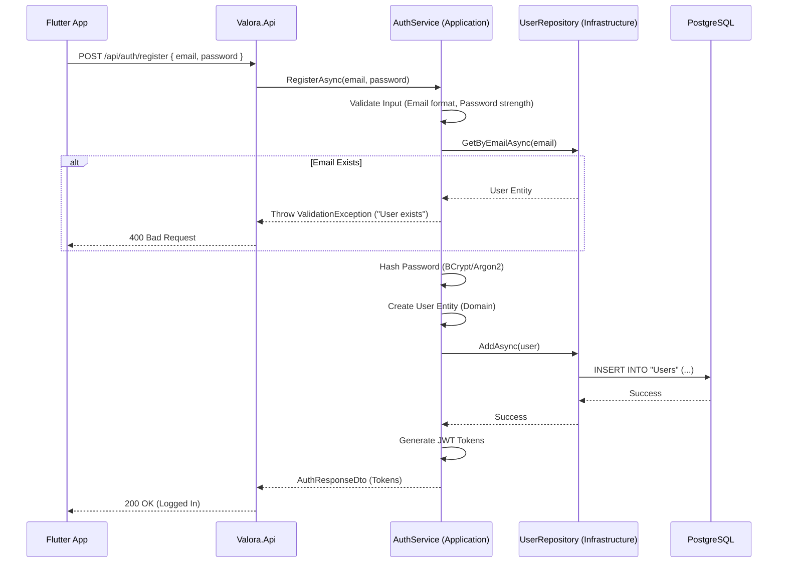

# Data Flow: From Request to Database (Persistence)

This guide explains how Valora handles "Write" operations, using **User Registration** as the primary example. It walks through the flow from the API endpoint down to the database persistence.

## High-Level Sequence

The following diagram illustrates the lifecycle of a `POST /api/auth/register` request.

## Detailed Steps

### 1. Request Handling (`Valora.Api`)
- The endpoint `POST /api/auth/register` receives the request body.
- It maps the JSON body to a `RegisterRequestDto`.
- It delegates the work to the `IAuthService` interface.

### 2. Application Logic (`Valora.Application`)
- **Validation:** The service checks business rules (e.g., password length, allowed domains).
- **Uniqueness Check:** It calls `IUserRepository.GetByEmailAsync` to ensure the user doesn't already exist.
- **Entity Creation:** It instantiates a new `User` entity from `Valora.Domain`. This ensures the entity is always in a valid state.
- **Security:** Passwords are never stored in plain text. The service uses a password hasher to generate a secure hash.

### 3. Infrastructure & Persistence (`Valora.Infrastructure`)
- **Repository Pattern:** The `UserRepository` implements `IUserRepository`. It encapsulates all EF Core logic.
- **EF Core:** The repository uses `ValoraDbContext` to add the new user.
- **Transaction:** The operation is atomic. `SaveChangesAsync` is called to commit the transaction to PostgreSQL.

### 4. Response
- Upon successful persistence, the service generates an Access Token and Refresh Token.
- These are returned to the client in an `AuthResponseDto`.

## Key Concepts

### Command vs. Query
Valora separates "Reads" (Queries) from "Writes" (Commands).
- **Reads** (like Context Reports) often bypass the Domain layer for performance or aggregation.
- **Writes** (like Registration) **always** go through the Domain layer to enforce invariants and business rules.

### Domain Entities
Entities in `Valora.Domain` are not just data bags. They contain logic.
- Example: `User.UpdatePassword(...)` handles the state change, rather than the service modifying properties directly.

### Repositories
We use repositories to abstract the database.
- **Why?** It allows us to swap the database (e.g., to In-Memory for tests) without changing the business logic.
- **Rule:** Services should never depend on `DbContext` directly.
