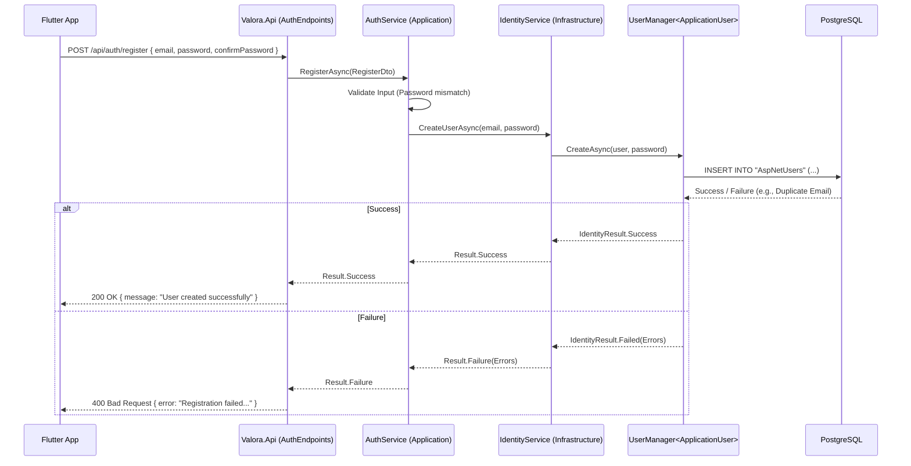

# Data Flow: From Request to Database (Persistence)

This guide explains how Valora handles "Write" operations, using **User Registration** as the primary example. It walks through the flow from the API endpoint (Presentation) down to the database persistence (Infrastructure).

> **Context:** This flow corresponds to the "Write" path in our CQRS-lite architecture.

## High-Level Sequence

The following diagram illustrates the lifecycle of a `POST /api/auth/register` request.

## Detailed Steps

### 1. Presentation Layer (`Valora.Api`)
- The endpoint `POST /api/auth/register` receives the request body.
- It maps the JSON body to a `RegisterDto`.
- It delegates the work to the `IAuthService` interface.

### 2. Application Layer (`Valora.Application`)
- **Validation:** The service checks business rules (e.g., password matches confirmation).
- **Identity Abstraction:** It calls `IIdentityService.CreateUserAsync`. The application layer does *not* depend directly on ASP.NET Core Identity.
- **Security:**
  - Passwords are hashed automatically by `UserManager` (using PBKDF2/Argon2 by default).
  - **Error Handling:** If registration fails (e.g., email exists), the service logs the specific error for debugging but returns a generic result to the API layer to prevent User Enumeration attacks.

### 3. Infrastructure Layer (`Valora.Infrastructure`)
- **Identity Service:** The `IdentityService` wraps `UserManager<ApplicationUser>`.
- **EF Core Identity:** The `ValoraDbContext` inherits from `IdentityDbContext` to manage user tables (`AspNetUsers`, `AspNetRoles`, etc.).
- **Transaction:** `UserManager` handles the database transaction implicitly.

### 4. Response
- Upon successful persistence, the API returns a simple 200 OK message.
- **Note:** The client must subsequently call `/api/auth/login` to obtain Access and Refresh tokens. Tokens are *not* returned immediately upon registration.

## Key Concepts

### Command vs. Query
Valora separates "Reads" (Queries) from "Writes" (Commands).
- **Reads** (like Context Reports) often bypass the Domain layer for performance or aggregation.
- **Writes** (like Registration) **always** go through the Domain or Identity layer to enforce invariants and business rules.

### Identity Management
We use ASP.NET Core Identity for user management but abstract it behind `IIdentityService`.
- **Why?** This keeps `Valora.Application` clean of framework-specific dependencies (Clean Architecture).
- **Repositories?** For standard entities (like `ContextReport`), we use Repositories. For Users, we use the `IdentityService` wrapper.
