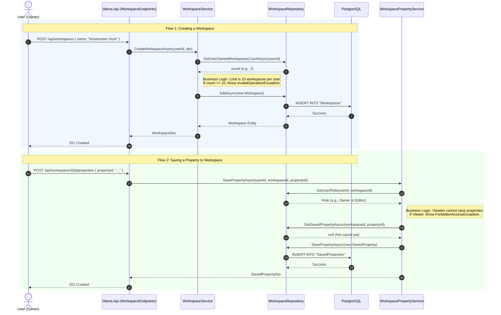

# Data Flow: Workspaces & Collaboration

This guide explains how Valora's collaboration features operate, tracing the data flow from the API down to database persistence for Workspaces, Members, and Saved Properties.

## 👥 The Workspace Concept
A "Workspace" acts as a shared folder where users can save and organize context reports for specific properties. Workspaces support a role-based access control (RBAC) model:
- **Owner:** Creator of the workspace. Can delete the workspace and manage members.
- **Editor:** Can save and remove properties, and invite other members.
- **Viewer:** Read-only access to saved properties.

---

## 🏗️ Architecture & Data Flow Diagram

The following Mermaid sequence diagram visualizes the flow when a user creates a workspace and saves a property.

## 🧠 Key Design Decisions

### 1. Hard Limits on Ownership (Max 10)
Users are restricted to owning a maximum of 10 workspaces.
**Why?** This prevents database bloat and abuse from malicious actors or bots creating thousands of empty workspaces. Users can still be *members* of an unlimited number of workspaces owned by others.

### 2. Idempotent Property Saves
When saving a property to a workspace, the `WorkspacePropertyService` first checks if the property already exists in that workspace.
**Why?** If a user clicks "Save" twice quickly due to network lag, or multiple team members save the same property simultaneously, we silently return the existing record instead of throwing a generic database constraint error. This provides a smoother UX.

### 3. Separation of Concerns in Services
Workspace logic is split into `WorkspaceService`, `WorkspaceMemberService`, and `WorkspacePropertyService`.
**Why?** Adhering to the Single Responsibility Principle (SRP). A single monolithic `WorkspaceService` handling CRUD for workspaces, member invitations, role updates, property saves, and commenting would quickly become unmaintainable.
