# Data Flow: Workspaces & Collaboration

This document explains the flow of data when users create workspaces, invite colleagues, and save context reports to share.

## The Concept

Valora generates context reports in real-time ("Fan-Out"). However, real estate searches are inherently collaborative. **Workspaces** provide a persistent layer where these ephemeral reports can be saved, organized, and discussed.

When a user "saves" a report to a workspace, the system takes a snapshot of the Fan-Out result and persists it to the `WorkspaceProperties` table as a JSON document.

## Collaboration Flow Diagram

The following Mermaid diagram illustrates the lifecycle of a Workspace: from creation, to inviting a member, to saving a property and adding a comment.

```mermaid
sequenceDiagram
    participant UserA as Alice (Owner)
    participant UserB as Bob (Invitee)
    participant API as Valora API
    participant W_Svc as WorkspaceService
    participant WM_Svc as WorkspaceMemberService
    participant WP_Svc as WorkspacePropertyService
    participant DB as PostgreSQL
    participant Event as NotificationHandler

    %% 1. Create Workspace
    rect rgb(30, 40, 50)
        Note over UserA, DB: 1. Workspace Creation
        UserA->>API: POST /api/workspaces {"name": "Amsterdam Trip"}
        API->>W_Svc: CreateWorkspaceAsync()
        W_Svc->>DB: INSERT INTO Workspaces
        W_Svc->>DB: INSERT INTO WorkspaceMembers (Role: Owner)
        DB-->>W_Svc: Workspace (Id: 123)
        W_Svc-->>API: 201 Created
        API-->>UserA: Workspace Created
    end

    %% 2. Invite Member
    rect rgb(40, 50, 60)
        Note over UserA, DB: 2. Inviting a Collaborator
        UserA->>API: POST /api/workspaces/123/members {"email": "bob@example.com"}
        API->>WM_Svc: AddMemberAsync()
        WM_Svc->>DB: Lookup User by Email
        WM_Svc->>DB: INSERT INTO WorkspaceMembers (Role: Editor)
        WM_Svc->>Event: Dispatch(WorkspaceInviteSentEvent)
        Event->>DB: INSERT INTO Notifications (For: Bob)
        WM_Svc-->>API: 200 OK
        API-->>UserA: Member Invited
    end

    %% 2b. Accept Invite
    rect rgb(30, 40, 50)
        Note over UserB, DB: 2b. Accepting the Invite
        UserB->>API: POST /api/workspaces/123/members/accept
        API->>WM_Svc: AcceptInviteAsync()
        WM_Svc->>DB: UPDATE WorkspaceMembers (IsPending: false)
        WM_Svc->>Event: Dispatch(WorkspaceInviteAcceptedEvent)
        Event->>DB: INSERT INTO Notifications (For: Alice)
        WM_Svc-->>API: 200 OK
        API-->>UserB: Invite Accepted
    end

    %% 3. Save Report Snapshot
    rect rgb(30, 40, 50)
        Note over UserB, DB: 3. Saving a Report Snapshot
        UserB->>API: POST /api/workspaces/123/properties/from-report {"report": {...}}
        API->>WP_Svc: SaveContextReportAsync()
        WP_Svc->>WP_Svc: Validate Report Structure
        WP_Svc->>DB: INSERT INTO WorkspaceProperties (Snapshot JSON)
        WP_Svc->>Event: Dispatch(ReportSavedToWorkspaceEvent)
        Event->>DB: INSERT INTO Notifications (For: Alice)
        WP_Svc-->>API: 200 OK
        API-->>UserB: Property Saved
    end

    %% 4. Add Comment
    rect rgb(40, 50, 60)
        Note over UserA, DB: 4. Discussing the Property
        UserA->>API: POST /api/workspaces/123/properties/456/comments {"content": "Too expensive."}
        API->>WP_Svc: AddCommentAsync()
        WP_Svc->>DB: INSERT INTO PropertyComments
        WP_Svc->>Event: Dispatch(CommentAddedEvent)
        Event->>DB: INSERT INTO Notifications (For: Bob)
        WP_Svc-->>API: 200 OK
        API-->>UserA: Comment Added
    end
```

## Key Architecture Decisions

1.  **Snapshotting vs Live Links:** When a property is saved to a workspace, the full `ContextReportDto` is serialized to a JSON string and stored in the database. We do this to ensure the data the user discusses exactly matches what they saw when they saved it, avoiding confusion if the external CBS/PDOK data updates a month later.
2.  **Domain Events for Notifications:** Notice how the `WorkspacePropertyService` does *not* insert records directly into the `Notifications` table. It dispatches a `CommentAddedEvent`. This follows **Clean Architecture**, decoupling the core workspace logic from the side-effect of notifying users.
