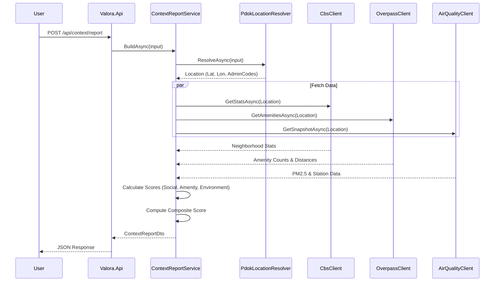

# Valora Onboarding

## Goal

Get a local environment running and generate your first context report within 10 minutes.

## First 10 Minutes

1.  **Start Infrastructure**
    ```bash
    docker-compose -f docker/docker-compose.yml up -d
    ```

2.  **Run Backend**
    ```bash
    cd backend
    cp .env.example .env
    dotnet run --project Valora.Api
    ```

    *Check*: Open `http://localhost:5001/api/health` to confirm the service is healthy.

3.  **Run Frontend**
    ```bash
    cd apps/flutter_app
    cp .env.example .env
    flutter pub get
    flutter run
    ```

4.  **Generate Report**
    *   Register/Login in the app.
    *   Go to the `Report` tab.
    *   Enter an address (e.g., "Damrak 1, Amsterdam").
    *   Tap "Generate".

## Product Mental Model

*   **No Scraping**: We do not parse HTML from listing sites.
*   **Location First**: Listing links are only used to extract an address or location hint.
*   **Public Data**: All context comes from open data sources (PDOK, CBS, OSM, Luchtmeetnet).

## Life of a Request: Context Report

When a user requests a report, the following flow occurs:



### Step-by-Step

1.  **Request**: The API receives `POST /api/context/report` with an input string.
2.  **Resolution**: `PdokLocationResolver` queries the PDOK Locatieserver to find the coordinates and administrative hierarchy (Municipality, Neighborhood).
3.  **Enrichment**: `ContextReportService` triggers parallel calls to:
    *   `CbsClient`: Demographics, income, and housing value stats.
    *   `OverpassClient`: Counts of amenities (schools, supermarkets) and distances.
    *   `AirQualityClient`: PM2.5 levels from the nearest station.
4.  **Scoring**: Raw data is normalized into scores (0-100).
    *   *Social Score*: Density, Income, Property Value.
    *   *Amenity Score*: Proximity and volume of services.
    *   *Environment Score*: Air quality.
5.  **Response**: The aggregated `ContextReportDto` is returned to the client.

## Where To Change What

*   **New Data Source**: Implement a client in `Valora.Infrastructure/Enrichment` and register it in `ContextReportService`.
*   **Scoring Logic**: Modify `ComputeCompositeScore` or private scoring methods in `ContextReportService.cs`.
*   **API Endpoints**: Defined in `Valora.Api/Program.cs`.
*   **Frontend UI**: `apps/flutter_app/lib/screens/context_report_screen.dart`.

## Common Issues

*   **401 Unauthorized**: You must register and login first. The JWT token is handled automatically by the app.
*   **Empty Report**: If external APIs are down or rate-limiting, the report will contain `warnings` but no data. Check the logs.
*   **Connection Refused**: Ensure the backend is running on port 5001 and the `API_URL` in `apps/flutter_app/.env` points to it.
