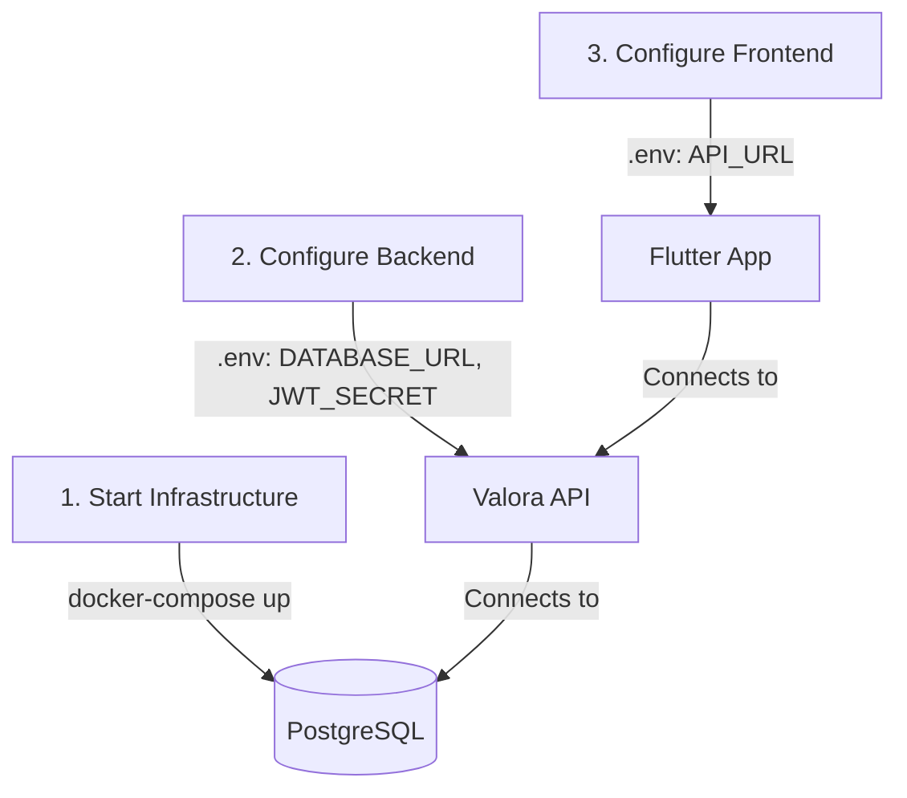

# Valora Onboarding

## Goal

Get a local environment running, understand the architecture, and generate your first context report.

## 1. Environment Setup (First 10 Minutes)

Use this visual guide to understand the dependencies between the setup steps.



### Prerequisites
- Docker Desktop
- .NET 10 SDK
- Flutter SDK

### Step 1: Start Infrastructure
Start the database (PostgreSQL).

```bash
docker-compose -f docker/docker-compose.yml up -d
```

*Verification:* Run `docker ps` and ensure `valora-db` is running.

### Step 2: Configure & Run Backend

1.  Navigate to the backend directory:
    ```bash
    cd backend
    ```
2.  Create the environment configuration:
    ```bash
    cp .env.example .env
    ```
3.  **Critical:** Open `.env` and verify these values:
    -   `DATABASE_URL`: Should match your docker setup (default is usually correct).
    -   `JWT_SECRET`: Must be a long, random string.
    -   `JWT_ISSUER` / `JWT_AUDIENCE`: Can be arbitrary strings for local dev (e.g., `ValoraApi`, `ValoraApp`).

4.  Run the API:
    ```bash
    dotnet run --project Valora.Api
    ```

*Verification:* Open a terminal and request the health endpoint:
```bash
curl http://localhost:5001/api/health
# Response should be: {"status":"healthy",...}
```

### Step 3: Configure & Run Frontend

1.  Navigate to the flutter app directory:
    ```bash
    cd ../apps/flutter_app
    ```
2.  Create the environment configuration:
    ```bash
    cp .env.example .env
    ```
3.  **Critical:** Check `API_URL` in `.env`.
    -   For Android Emulator: `http://10.0.2.2:5001/api`
    -   For iOS Simulator: `http://localhost:5001/api`

4.  Run the app:
    ```bash
    flutter pub get
    flutter run
    ```

## 2. Using the App

1.  **Register:** Create a new account on the login screen.
2.  **Generate Report:** Go to the "Report" tab.
3.  **Input:** Enter a Dutch address (e.g., "Damrak 1, Amsterdam") or a Funda URL.
4.  **Result:** View the generated context report with scores for Social, Safety, Amenities, etc.

## 3. Understanding the Architecture

To understand how the system works under the hood, we have two deep-dive guides:

1.  **[Data Flow: Reading (Reports)](onboarding-data-flow.md)**: Learn how the "Fan-Out" pattern aggregates data from CBS, PDOK, and OSM in real-time.
2.  **[Data Flow: Writing (Persistence)](onboarding-persistence-flow.md)**: Learn how user data and reports are securely saved to the database.

### Product Mental Model
- **Valora is not a scraper.** It does not copy listing photos or descriptions.
- **Input is a location hint.** A URL is parsed only to find the address.
- **Output is context.** The value is in the aggregation of public data (crime, demographics, air quality) surrounding that location.

## 4. Where To Change What

| Task | Files/Folders |
|---|---|
| **Add a new data source** | 1. Define interface in `Valora.Application/Common/Interfaces`<br>2. Implement client in `Valora.Infrastructure`<br>3. Add to `ContextReportService.cs` |
| **Adjust Scoring Logic** | `backend/Valora.Application/Services/ContextReportService.cs` (Look for `Score*` methods) |
| **Modify API Endpoints** | `backend/Valora.Api/Program.cs` |
| **Update UI Screens** | `apps/flutter_app/lib/screens/` |

## 5. Troubleshooting

### Backend fails to start?
-   **Error:** `InvalidOperationException: JWT_SECRET is not configured`
    -   **Fix:** Ensure you created `.env` in `backend/` and added a secret.
-   **Error:** Database connection refused
    -   **Fix:** Ensure Docker is running (`docker ps`). Check `DATABASE_URL` port matches Docker mapping.

### API returns 401 Unauthorized?
-   **Fix:** You must login first. The `ContextReport` endpoint is protected.

### Report is empty or missing sections?
-   **Cause:** External APIs (CBS, PDOK, etc.) might be down or rate-limiting.
-   **Check:** Look at the `warnings` array in the JSON response. The `ContextReportService` is designed to return partial data if one source fails.

### "Host lookup failed" in Flutter?
-   **Fix:** Check `API_URL` in `apps/flutter_app/.env`. Android Emulator cannot see `localhost`; use `10.0.2.2`.
