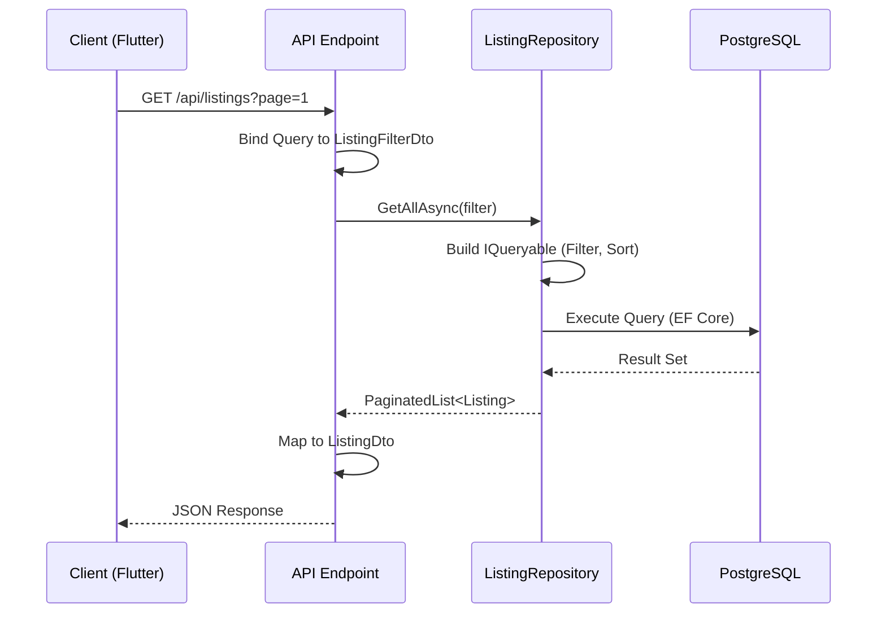

# Onboarding Guide: Data Flow & Life of a Request

This guide is designed to help new developers understand how data moves through the Valora system, specifically from an API request to database persistence and back.

## Life of a Request

When a user interacts with the Valora frontend (e.g., viewing listings), the following sequence occurs:

1.  **Client Request**: The Flutter app sends an HTTP request to the Backend API (e.g., `GET /api/listings`).
2.  **API Endpoint**: The request is handled by a Minimal API endpoint defined in `Program.cs`.
3.  **Binding**: Query parameters are bound to a DTO (Data Transfer Object) using `[AsParameters]`.
4.  **Application/Infrastructure Layer**: The API calls a Repository or Service (e.g., `IListingRepository`) to fetch or modify data.
5.  **Database Query**: The Repository uses Entity Framework Core to construct and execute a SQL query against PostgreSQL.
6.  **Response**: The data is returned to the API, mapped to a response DTO, and sent back to the client as JSON.

## Data Flow Diagram: GET /listings

The following diagram illustrates the flow for fetching a list of properties:

## Key Layers

*   **Valora.Api**: The entry point. Handles HTTP concerns, routing, and dependency injection. It should remain thin and delegate logic.
*   **Valora.Application**: Defines interfaces (e.g., `IListingRepository`) and DTOs. It knows *what* needs to happen but not *how*.
*   **Valora.Infrastructure**: Implements the interfaces. Contains the database context (`ValoraDbContext`), repositories, and external service implementations (e.g., `FundaScraperService`).
*   **Valora.Domain**: Contains the core business entities (e.g., `Listing`, `PriceHistory`). It has no dependencies on other layers.
