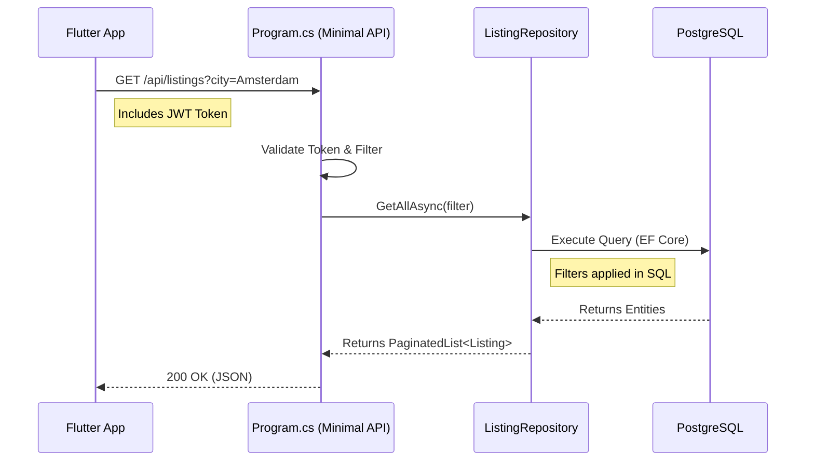
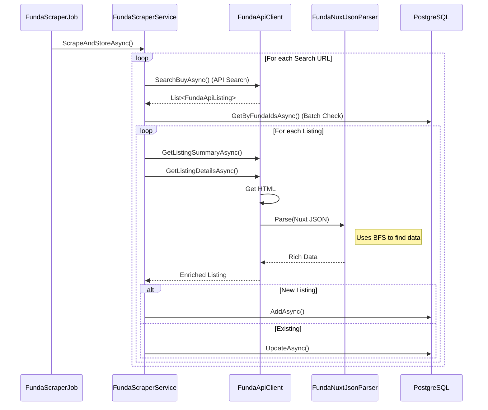

# Valora Onboarding Guide

Welcome to Valora! This guide is designed to help you understand the system's data flow and get you productive within 10 minutes.

## Data Flow Walkthrough

Understanding how data moves through the system is key to contributing effectively. We have two main data flows: **Reading Listings** (API) and **Scraping Listings** (Background Job).

### 1. The Read Flow: `GET /api/listings`

When a user opens the app, they request a list of real estate listings.

**Flow:** `Client` -> `API` -> `Repository` -> `Database`

**Key Points:**
- **Entry Point:** Defined in `backend/Valora.Api/Program.cs`.
- **Logic:** The API layer is thin. It validates the request and delegates to `ListingRepository`.
- **Data Access:** `ListingRepository` (in `Infrastructure`) uses Entity Framework Core to query PostgreSQL. We use `IQueryable` to ensure filtering happens in the database, not in memory.

---

### 2. The Scraper Flow: Data Ingestion

Valora populates its database by scraping Funda.nl. This happens in the background.

**Flow:** `Job` -> `Service` -> `Funda` -> `Parser` -> `Database`

**Key Components:**
- **`FundaScraperJob`**: The Hangfire job that triggers the process.
- **`FundaScraperService`**: The conductor. It coordinates fetching search results, enriching them with details, and saving them.
- **`FundaApiClient`**: Handles all HTTP communication with Funda. It mimics a browser and handles rate limiting.
- **`FundaNuxtJsonParser`**: A robust parser that extracts data from the specific Vue/Nuxt JSON structure embedded in Funda's HTML.

## Where to Start?

1.  **Run the App**: Follow the "Quick Start" in `README.md`.
2.  **Explore the API**: Look at `backend/Valora.Api/Program.cs` to see all available endpoints.
3.  **Debug the Scraper**: Trigger a manual scrape via `POST /api/scraper/trigger` and watch the logs.
