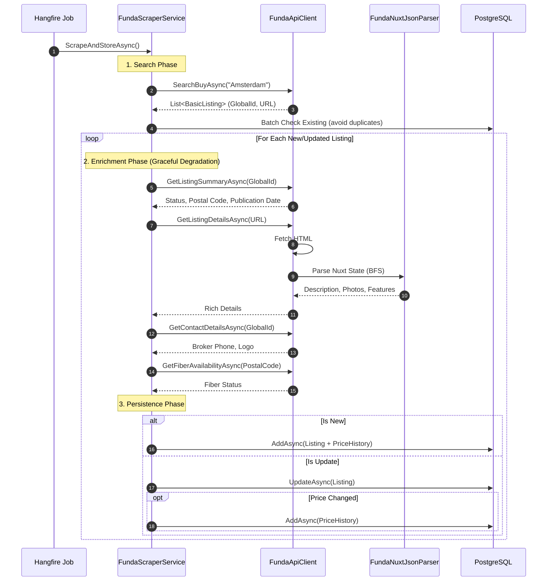
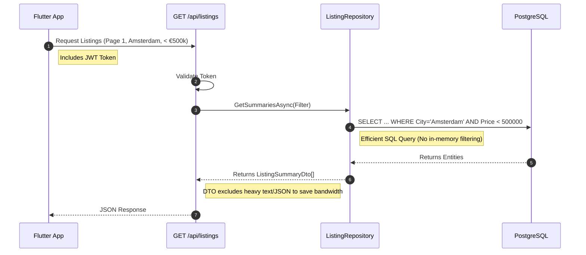

# Valora Onboarding Guide 🚀

Welcome to the team! This guide will take you from "zero" to "understanding exactly how data moves" in about 10 minutes.

---

## ⏱️ The First 10 Minutes: A Checklist

Before diving into code, complete these steps to verify your environment and see the system in action.

- [ ] **1. Start the Stack**: Run `docker-compose -f docker/docker-compose.yml up -d`.
      - *Verify*: `docker ps` shows postgres, redis (optional), and hangfire (if enabled).
- [ ] **2. Run the Backend**: In `backend/`, run `dotnet run --project Valora.Api`.
      - *Verify*: Open `http://localhost:5000/api/health` in your browser. Expect `{"status":"healthy"}`.
- [ ] **3. Trigger a Scrape (Magic Time)**:
      - We need data! Using Postman or Curl: `POST http://localhost:5000/api/scraper/trigger` (You might need a token if Auth is on, or use the `--environment Development` flag to bypass strict checks if configured).
      - *Verify*: Watch the terminal logs. You should see "Starting funda.nl scrape job" and "Found X listings".
- [ ] **4. Run the Frontend**: In `apps/flutter_app/`, run `flutter run`.
      - *Verify*: You see the dashboard populated with the data you just scraped.

---

## 🌊 Data Flow: The Life of a Listing

Understanding Valora means understanding how a listing travels from Funda's servers to our database and finally to the user's screen.

### 1. Ingestion: The Scraper (Write)

This is how we get data. It's not just one call; it's an orchestration of multiple endpoints to build a "Rich Listing".

**Orchestrator**: `FundaScraperService.cs`

**Key Takeaways:**
- **Aggregated Data**: We don't just "scrape a page". We combine data from the Search API, Summary API, Contact API, and the HTML page itself.
- **Resilience**: If the "Fiber Check" fails, we still save the listing. This is handled via try-catch blocks in `EnrichListingAsync`.

### 2. Consumption: The API (Read)

This is how the user sees data. We prioritize speed and low bandwidth.

**Entry Point**: `Valora.Api/Program.cs` (Minimal APIs)

**Key Takeaways:**
- **Thin API**: The controller logic is minimal.
- **Database Heavy Lifting**: All filtering happens in PostgreSQL.
- **DTOs**: We map Entities to DTOs (`ListingSummaryDto`) to avoid exposing internal database structure and to reduce payload size (e.g., we don't send the full description in the list view).

---

## 🧭 Navigating the Codebase

- **I want to change how we scrape data**: Go to `backend/Valora.Infrastructure/Scraping/`.
    - `FundaScraperService.cs`: The flow control.
    - `FundaApiClient.cs`: The raw HTTP calls.
    - `FundaNuxtJsonParser.cs`: The parsing logic.
- **I want to add a new filter**:
    - 1. Add property to `ListingFilterDto` (`Valora.Application`).
    - 2. Update `ListingRepository` (`Valora.Infrastructure`).
- **I want to change the database schema**:
    - 1. Modify `Listing` entity (`Valora.Domain`).
    - 2. Run `dotnet ef migrations add ...`.

## 🤝 Contribution Workflow

1.  Create a branch.
2.  Make changes.
3.  **Verify**: Run `dotnet test`.
4.  Submit PR.

Happy Coding! 👩‍💻👨‍💻
